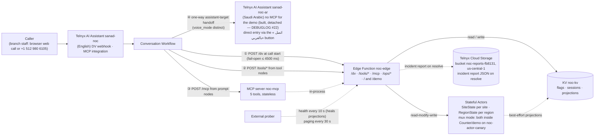

# NOC Front Door — Sanad, the 24/7 AI fault line

**Sanad** is Najd Networks' 24/7 AI fault line: it verifies, de-duplicates, escalates and pages — engineers get one clean ticket instead of a queue of duplicates.

[Live site](https://noc-edge-41d2a334-7.telnyxcompute.com/) · [Live board](https://noc-edge-41d2a334-7.telnyxcompute.com/ops/status?format=html) · [DEMO.md](DEMO.md) · [Architecture](docs/architecture.md) · [Decisions](docs/decisions.md) · [Q&A prep](docs/qa-prep.md) · [Setup](docs/setup.md) · [DEBUGLOG](DEBUGLOG.md)

## What it is

A KSA managed-services provider's NOC takes 24/7 outage calls from branch staff of its enterprise customers — the **Al-Waha Pharmacies** and **Rawda Cafés** chains. During a regional outage every affected branch calls separately, so the queue fills with **duplicate reports**. Why it matters: the **SLA clock starts when the fault is received**, not when a human finally picks up; and the de-dupe promise is **one ticket per site, one incident per region** — engineers see one clean ticket per fault instead of a queue of duplicates.

**Sanad** verifies the caller by site + PIN, recognises the regional incident, opens or joins tickets, escalates P2→P1 at the third branch, raises a page if the P1 is unacknowledged (a desktop notification on the operator's box in the demo; Telnyx SMS/voice paging is the production path), and hands over to a human on request. Telnyx Voice AI (Conversation Workflows) + Edge Compute (Functions, KV, Stateful Actors) + a custom MCP server. Binding design: [spec](docs/superpowers/specs/2026-09-26-noc-front-door-design.md) · decisions: [docs/decisions.md](docs/decisions.md) · data residency: [docs/sovereignty.md](docs/sovereignty.md).

## Try it

1. Open the production front page: **https://noc-edge-41d2a334-7.telnyxcompute.com/** — **Report an outage**: browser call or dial **+1 512 980 6105** (international from KSA) in English, or the **«اتصل بالعربي»** button for a browser call straight to the Arabic assistant; plus the live network status map. `/demo` serves the same page.
2. Run **scenario 1** as RUH-114 and watch the board: verify → advisory → **join** → **P2→P1** when the third branch hits. Scenario 2 — **open a new ticket**: call as JED-007 and describe the fault. Scenario 3 — **lockout & human**: call the reserved **DMM-011** (never RUH-114/JED-007), give a wrong PIN three times, then ask for a human (transfer; else callback). One-shot per staging — re-stage first ([pre-flight](docs/setup.md)); the **prober must be running** (DEBUGLOG #11). Script: [DEMO.md](DEMO.md).

| Site | Region | PIN | Scenario |
|---|---|---|---|
| RUH-114 — "the Al Yasmin branch" | Riyadh North | 5944 | Join the incident |
| JED-007 | Jeddah | 7985 | Open a new ticket |

The **operator console** is hidden — `#console` or the backtick key: scenario cards with the two demo PINs (copy on click, from the `DEMO_GUIDE` secret, no PIN literal in code), detailed board, event feed, presenter controls.

### Live endpoints

| URL | What it is | Auth |
|---|---|---|
| `/`, `/demo` | front page: report an outage (browser call or `+1 512 980 6105`) + live status map | none |
| `/ops/board`, `/ops/status` (JSON or `?format=html`) | public read-only (masked) actor views | none |
| `/dv`, `/tools/*` | assistant webhooks; identity from the signed body (C13) | Ed25519 — unsigned → 403, fail closed |
| `/mcp` | MCP server: 5 tools, stateless, `GET` → 405 (C4) | bearer (`401` without; sample in [docs/setup.md](docs/setup.md)) |

Other `/ops/*` routes are operator-only — ops bearer via `node scripts/ops.mjs`, not published. The public line **`+1 512 980 6105`** has been live since the account was verified on 2026-09-28 (DEBUGLOG #1). The MCP bearer is shared privately with reviewers in the submission email (spec §16).

### Production path

In the demo, a P1 page is a desktop notification on the operator's box; the production path is **Telnyx SMS/voice paging** to the on-call rota. Verification in production stays `require_pin=true`, plus **caller-ID trust** for known branch numbers. The public board is read-only and masked for the demo; production puts it behind **board auth** (operator SSO). Data residency: see [docs/sovereignty.md](docs/sovereignty.md).

## Architecture



- **Actors own the invariants** (C6) — 10 concurrent opens → **1 ticket** ([race test](docs/evidence/race-test.txt)).
- **KV only projects / caches / flags** (C5) — the prober re-syncs projections.
- **KV-free voice path** — the site actor is the PIN authority: `verify_site` awaits only the actor, every other KV wait is deadline-bounded, and ticket writes authorise from the actor's own PIN record (`openIfVerified`) even with KV down (DEBUGLOG #19).
- **Mux mode** (DEBUGLOG #4) — same classes in the one working instance behind `ActorPort`; per-entity was switched on and reverted to mux on 2026-10-01 — pings and the race test answered per-entity, but the business methods 500'd through the binding (DEBUGLOG #21).
- **Two assistants, one-way handoff** — `sanad-noc` (English) hands the call to `sanad-noc-ar` (Saudi Arabic: voice `Telnyx.Bayan.Reem`, STT `soniox/stt-rt-v5`, its own 16-node workflow; its MCP registration is built and tested but detached for the demo — DEBUGLOG #22). The 8 llm "Arabic" edges route through the speak node `s_to_ar` ("Sure, switching you to Arabic now. One moment, please."), whose one default edge targets the Arabic assistant; `e_sopen_ar` (`route_hint=="arabic"`) targets the assistant directly, and a `requireArabicExits` validator rule enforces an Arabic exit from every English prompt node. The handoff fires on an explicit Arabic request only; it keeps the conversation, history and variables, and `s_ar_open` routes by carried state — verified → triage, known incident → advisory, ticket open → confirm — so a caller verified in English is never asked for the PIN again. First verified EN→AR handoff: call #9 (DEBUGLOG #22). The platform intermittently drops the Arabic assistant's first turn after the handoff (#12/#13, DEBUGLOG #22 — being reported to Telnyx), so the front page also offers the direct Arabic entry («اتصل بالعربي»); phone callers still reach Arabic through the handoff.
- **`/dv` fail-open** (C3); identity from the signed body (C13); unsigned → 403.
- **One trace_id per call** (`scripts/trace.sh`).

Full rationale: [docs/architecture.md](docs/architecture.md).

## How it meets the brief

| Requirement | Evidence |
|---|---|
| Conversation Workflow — prompt/speak/tool nodes, `llm`/`expression`/`default` edges | Zero DRIFT on apply, both assistants (DEBUGLOG #7); calls #2–#6 ([voice calls](docs/evidence/voice-calls.md)) |
| Callable — web call + phone | Live — browser or `+1 512 980 6105` ([PSTN call #5](docs/evidence/voice-calls.md)) |
| Custom MCP server, ≥3 tools (C4) | Live initialize + `tools/list` = 5 tools ([architecture appendix](docs/architecture.md)); in-call on #4/#6 ([voice calls](docs/evidence/voice-calls.md)) |
| DV webhook from an Edge Function, influencing routing | Built — signed, fail-open; identified routing unit-tested + `flag/demo_caller` toggles ([runbook](docs/runbook.md) demo-call toggles); recorded identified call TODO-LIVE |
| Edge Functions | Live — routes verified 2026-09-27 (DEBUGLOG #4, update 09-27) |
| KV | Flags live ([runbook](docs/runbook.md)) |
| Stateful Actors, read-modify-write (C11) | 10 opens → 1 ticket ([race test](docs/evidence/race-test.txt)) |
| Observability — logs, signal, minute answer | ≈ ≤30 s alert ([runbook](docs/runbook.md)) |
| A real debugging story | Found from the call's own trace (#8) |
| OpenCode + Telnyx Inference | 98 of 126 commits as of `93e210a` (78 GLM-5.3-Flash · 18 GLM-5.3 · 2 Kimi-K3) ([DOGFOODING.md](DOGFOODING.md)) |
| Public deployment + docs | Live since 2026-09-27 |

Stretch goals:

| Goal | Status | Evidence |
|---|---|---|
| Variable-comparison edges | Built & live | P1 at 3 sites live (voice call #3) |
| DV steering identified callers | Built — unit-tested + demo toggles | Anonymous calls answer safe defaults (DEBUGLOG #6/#8); recorded identified call TODO-LIVE |
| KV feature flags | Built & live | `flag/actor_mode=mux` flipped live, no redeploy; drills ([runbook](docs/runbook.md)) |
| Shared actors | Built & live | `/ops/actor-ping` |
| Distributed tracing | Built & live | `scripts/trace.sh` |
| Actor alarms | Built & live | Page `INC-1004:p1` sent 21:51:53Z ([alarms-live.md](docs/evidence/alarms-live.md)) |
| Incident reports → Cloud Storage | Built & live | INC-1004 report written, listed, fetched 2026-09-28 (DEBUGLOG #13) |
| Multi-assistant | Built & live | Handoff proven on live call #6, first verified EN→AR on #9 (DEBUGLOG #18/#22); Arabic MCP built & tested, detached for the demo (decisions #9); direct Arabic entry «اتصل بالعربي» (text- and voice-tested 2026-10-01, DEBUGLOG #22) |
| Live NOC console | Built & live | Production front page + hidden operator console (`#console` / backtick), live 2026-09-28 |
| Voice-model upgrade | Evaluation pending | Needs live calls (no credit spent) |

Tradeoffs and the per-node tool matrix: [docs/decisions.md](docs/decisions.md). Panel Q&A prep: [docs/qa-prep.md](docs/qa-prep.md).

## Observability

### Know within a minute

The external prober (dev box, outside the failure domain) probes `GET /ops/health/deep` every 10 s, alerts after **2 consecutive failures** (worst case ≈ 30 s), covering the edge function + KV, actors, MCP; assistant-level failures surface in the Portal + per-call trace. An actor **hang** that outlives two probes counts as **down** (`actor_hung`), not "slow" — the 2026-09-28 incident showed up as 30 s hangs (DEBUGLOG #15). `degraded` with `slow:["kv"]` is **not** an outage (DEBUGLOG #6). First look: the invocation log, then `scripts/trace.sh t-<trace_id>` ([docs/runbook.md](docs/runbook.md)).

Load discipline ([detail](docs/architecture.md)): board cached **30 s from build completion** (10 s degraded); failed flag reads → **30 s cooldown**; public page polls **15 s, visible-only**, pauses after **10 min idle**.

### A real bug, end to end

Voice call #1 (trace `t-5d419f3a98a3240f`): **correct** PIN, but `verify_site` took **7869 ms** — over its 5000 ms timeout — verification failed, no ticket opened. Found from the call's own trace (`tool.verify_site` total_ms vs the timeout). Root cause (DEBUGLOG #6): sequential ~1–2 s KV ops in the tool webhooks. Fix: concurrent KV. Calls #2/#3 verified in **3.6 s**; INC-1002 went **P1 at 3 sites** — one `trace_id` across every hop (`scripts/trace.sh`, DEBUGLOG #8; [voice-calls.md](docs/evidence/voice-calls.md)). Full trail: [DEBUGLOG.md](DEBUGLOG.md) (#1–#22).

## Challenges & solutions

- **No new actor instances** (DEBUGLOG #4; lifted for new instances 2026-09-30) → mux host: same classes in the one working instance; alarm fanned out (DEBUGLOG #12); per-entity flipped and reverted to mux on 2026-10-01 (DEBUGLOG #21).
- **KV ~1–2 s/op** (DEBUGLOG #6) → concurrency + deadlines; the KV-free voice path makes the actor the PIN authority (DEBUGLOG #19); the prober heals projections (DEBUGLOG #11).
- **Voice model skipped "say, then call the tool"** → mandatory actions are **tool nodes**, enforced by `flow-validate` on every apply.
- **No number until verification** (DEBUGLOG #1) → verified 2026-09-28: line `+1 512 980 6105` + browser widget; identified callers via `flag/demo_caller` ([runbook](docs/runbook.md)).
- **One assistant, never deleted** (C1) → config-as-code (`scripts/apply.mjs`) with read-back `DRIFT`.

## Setup

Prerequisites: a Telnyx account + API key (Trial is fine), the [`telnyx-edge` CLI](https://telnyx.com/products/edge-infra), **Node 22**. Full version (`.env` keys, secrets, bucket, deploy timings, troubleshooting): [docs/setup.md](docs/setup.md).

1. `npm ci` in the root and each `edge/*` package (`npm --prefix … ci`).
2. `cp .env.example .env` — fill the keys ([docs/setup.md](docs/setup.md)).
3. `bash scripts/setup-edge.sh` (idempotent: **KV namespace `noc-kv`**, Edge secrets), then `telnyx-edge secrets add` the per-function secrets (`ONCALL_NUMBER`, `SEED_LOCAL` — demo PINs only here — `DEMO_GUIDE`) and set the bucket (`noc-reports-fb8131`, us-central-1) in `edge/noc-edge/telnyx.toml`.
4. Ship owner → host → edge: `telnyx-edge ship` in `edge/noc-actors`, `edge/noc-actor-host`, `edge/noc-edge` (**15–35 min** each). On DEBUGLOG #4 accounts set mux: `kv key put "$KV_ID" flag/actor_mode mux` (verify: `/ops/actor-ping`).
5. Apply the assistants: `EDGE_URL=<origin> node scripts/apply.mjs --dry-run`, then for real — upserts **both** by name (`sanad-noc-ar` first, then `sanad-noc` with the Arabic id), prints `DRIFT` (empty = clean).
6. Start the prober (`node scripts/prober.mjs`; keep it running) and pre-flight: `POST /ops/reset`, then `POST '/ops/stage-incident?region=riyadh-north'` — staged P2, escalation due in 5 min.

## Code walkthrough

Eight ordered stops (`file:lines — what — why`): [docs/walkthrough.md](docs/walkthrough.md).

## How it was built

Claude is architect and reviewer — spec, plans, task prompts; every implementer task is independently reviewed before merge. Shipped artifacts are authored through **OpenCode on Telnyx Inference** (`telnyx/zai-org/GLM-5.3-Flash` default) via the `@telnyx/opencode` plugin ([`opencode.jsonc`](opencode.jsonc)).

**Exceptions**, besides docs: the CLI scaffolds (committed by the architect), the Claude-written visual layer (`edge/noc-edge/src/demo/page.ts` + its tests — the front page and its hidden operator console; two OpenCode versions were rejected as generic), and one architect revert (`a94722c`) during a live incident (DEBUGLOG #17). Cost, review catches, the commit split: [`DOGFOODING.md`](DOGFOODING.md).

## Repo map

```
assistant/            Workflows (EN + AR) + tools; applied by scripts/apply.mjs
edge/noc-edge/         Edge Function: /dv, /tools/*, /mcp, /ops/*, / + /demo; ActorPort seam
edge/noc-actors/       SiteState + RegionState classes (binding-free owner)
edge/noc-actor-host/   Mux-mode host (same classes, one instance)
edge/noc-probe/        Plan-0 diagnostics probe (DEBUGLOG #2–#4)
edge/shared/           Pure libs: ids, deadline(), Ed25519 verify, logging, masking, authz
scripts/               apply, prober, ops, trace.sh, race-test, preflight, secret-scan
docs/                  Spec, plans, runbook, evidence, setup, architecture, walkthrough, decisions
```

## Known limitations

- **Telnyx platform incident 2026-09-28/29** (DEBUGLOG #15) — actor runtime broke 06:14:44Z, KV data plane from 19:06Z, ended ~13:05Z on 09-29; reproduces on paths our code cannot touch.
- **Per-entity actors: flipped and reverted** — switched on 05:34:28Z on 2026-10-01, reverted to mux at 05:54:53Z: per-entity pongs answered (195–227 ms, 4/4; race 1/10 vs KV 10/10) but `verify_site` 500'd — our timing wrapper `timedApi` collects method names via `Object.getOwnPropertyNames`, and the SDK's Proxy-shaped actor stub exposes none, so the wrapped port had no business methods while `/ops/actor-ping` and `/dv` used the raw port (DEBUGLOG #21). Live traffic runs mux behind `flag/actor_mode` (held at `mux` with no expiry); mux stays the instant fallback (`/ops/actor-ping` shows the mode); the wrapper fix is prepared on a branch, re-flip after demo day.
- **Arabic handoff is intermittent on the platform** — call #9 proved the re-verification skip live (`s_ar_open` routed a verified caller to `n_ar_confirm`, no PIN re-ask — DEBUGLOG #22), but #12/#13 went silent >20–30 s under identical config while the Arabic DV webhook answered 1.3–1.5 s every time; a Telnyx voice-runtime issue being reported with the conversation ids (DEBUGLOG #22). The front page's «اتصل بالعربي» button calls `sanad-noc-ar` directly and sidesteps it (voice-tested 2026-10-01, headless fake-microphone run — DEBUGLOG #22).
- **PII in Telnyx transcripts** — Telnyx stores call transcripts and conversation insights, which contain the PIN as spoken; the assistants do not enable PII redaction. Production answer: enable redaction where available, and move to one-time per-call PINs ([docs/sovereignty.md](docs/sovereignty.md)).
- **KV ~1–2 s/op** (DEBUGLOG #6) → latency-shaped routes; `degraded` ≠ down; keep the prober running (DEBUGLOG #11).
- **Voice-model A/B pending** — TTS "Ultra" shortlist, STT `deepgram/flux` vs nova-3 (no credit spent).
