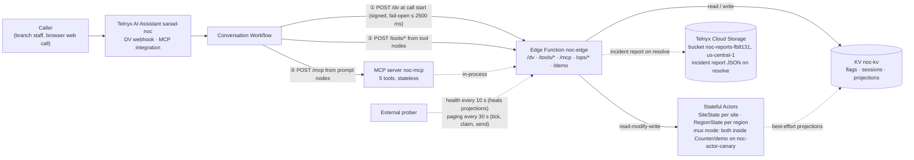

# NOC Front Door — Sanad, the 24/7 AI fault line

**Sanad** is the 24/7 AI fault line of Najd Networks, a fictional KSA managed-services provider: it verifies, de-duplicates, escalates and pages — engineers get one clean ticket instead of a queue of duplicates.

[Live demo](https://noc-edge-41d2a334-7.telnyxcompute.com/demo) · [Live board](https://noc-edge-41d2a334-7.telnyxcompute.com/ops/status?format=html) · [DEMO.md](DEMO.md) · [Architecture](docs/architecture.md) · [Setup](docs/setup.md)

## What it is

A KSA managed-services provider's NOC takes 24/7 outage calls from branch staff of its enterprise customers — the **Al-Waha Pharmacies** and **Rawda Cafés** chains. During a regional outage every affected branch calls separately, so the queue fills with **duplicate reports**.

**Sanad** verifies the caller by site + PIN, recognises the regional incident, opens or joins tickets, escalates P2→P1 at the third branch, pages on-call if the P1 is unacknowledged, and hands over to a human on request. Telnyx Voice AI (Conversation Workflows) + Edge Compute (Functions, KV, Stateful Actors) + a custom MCP server. Binding design: [spec](docs/superpowers/specs/2026-09-26-noc-front-door-design.md).

## Try it

1. Open the **NOC wall**: **https://noc-edge-41d2a334-7.telnyxcompute.com/demo**
2. Press **Start call** (`C`; `B` board, `1`–`3` scenarios; PIN chips copy on click — from the `DEMO_GUIDE` secret, no PIN literal in code).
3. Run **scenario 1** as RUH-114 and watch the board: verify → advisory → **join** → **P2→P1** when the third branch hits.

| Site | Region | PIN | Scenario |
|---|---|---|---|
| RUH-114 — "the Al Yasmin branch" | Riyadh North | 5944 | Join the incident |
| JED-007 | Jeddah | 7985 | Fresh ticket |

Scenario 2 — **lockout**: call the reserved **DMM-011** (never RUH-114/JED-007). Scenario 3: ask for a human (transfer; else callback). One-shot per staging — re-stage first ([pre-flight](docs/setup.md)); the **prober must be running** (DEBUGLOG #11). Full script: [DEMO.md](DEMO.md).

### Live endpoints

Base origin: `https://noc-edge-41d2a334-7.telnyxcompute.com`.

| URL | What it is | Auth |
|---|---|---|
| `/demo` | NOC wall + call widget + operator drawer | none |
| `/ops/board`, `/ops/status` (JSON or `?format=html`) | public read-only (masked) actor views | none |
| `/dv`, `/tools/*` (`verify-site`, `open-ticket`, `join-incident`, `callback`) | assistant webhooks; identity from the signed body (C13) | Ed25519 — unsigned → 403, fail closed |
| `/mcp` | MCP server: 5 tools, stateless, `GET` → 405 (C4) | bearer (`401` without; sample in [docs/setup.md](docs/setup.md)) |

Other `/ops/*` routes are operator-only — ops bearer via `node scripts/ops.mjs`, not published. **No phone number on this Trial** (none can be ordered — KSA origin, no local coverage; DEBUGLOG #1; verification request pending since 2026-09-26); web calls are the substitute. The MCP bearer is shared privately with reviewers in the submission email (spec §16).

## Architecture



- **Actors own the invariants** (C6) — 10 concurrent opens → **1 ticket** ([race test](docs/evidence/race-test.txt)).
- **KV only projects / caches / flags** (C5) — the prober re-syncs projections.
- **Mux mode** (DEBUGLOG #4) — same classes in the one working instance behind `ActorPort`.
- **`/dv` fail-open** (C3); identity from the signed body (C13); unsigned → 403.
- **One trace_id per call** (`scripts/trace.sh`).

Full rationale: [docs/architecture.md](docs/architecture.md).

## How it meets the brief

| Requirement | Evidence |
|---|---|
| Conversation Workflow — prompt/speak/tool nodes, `llm`/`expression`/`default` edges | Zero DRIFT on apply ([voice calls](docs/evidence/voice-calls.md)) |
| Callable — web call + `/demo` | Live — [/demo](https://noc-edge-41d2a334-7.telnyxcompute.com/demo) |
| Custom MCP server, ≥3 tools (C4) | Live `tools/list` = 5 (DEBUGLOG #9) |
| DV webhook from an Edge Function, influencing routing | Signed and steering ([runbook](docs/runbook.md)) |
| Edge Functions | Live 2026-09-27 (DEBUGLOG #4) |
| KV | Flags live ([runbook](docs/runbook.md)) |
| Stateful Actors, read-modify-write (C11) | 10 opens → 1 ticket ([race test](docs/evidence/race-test.txt)) |
| Observability — logs, signal, minute answer | ≈ ≤30 s alert ([runbook](docs/runbook.md)) |
| A real debugging story | Found within a minute (#5) |
| OpenCode + Telnyx Inference | 57 commits ([DOGFOODING.md](DOGFOODING.md)) |
| Public deployment + docs | Live since 2026-09-27 |

Stretch goals (statuses as of 2026-09-28):

| Goal | Status | Evidence |
|---|---|---|
| Variable-comparison edges | Built & live | P1 at 3 sites live (voice call #3) |
| DV webhook steering identified callers | Built & live | DEBUGLOG #6/#8; [runbook](docs/runbook.md) |
| KV feature flags | Built & live | Fault drills ([runbook](docs/runbook.md)) |
| Shared actors | Built & live | `/ops/actor-ping` |
| Distributed tracing | Built & live | `scripts/trace.sh` |
| Actor alarms | Built & live | Page `INC-1004:p1` sent 21:51:53Z ([alarms-live.md](docs/evidence/alarms-live.md)) |
| Incident reports → Cloud Storage | Built, deploy pending | No live write yet (DEBUGLOG #13) |
| Arabic mode | Built, config live | Applied 2026-09-28 00:18 UTC+3 |
| Live NOC console | Built & live | Live 2026-09-27 23:28 UTC+3 |
| Voice-model upgrade | Evaluation pending | Needs live calls (no credit spent) |

Full detail: [docs/architecture.md](docs/architecture.md) (appendix).

## Observability

### Know within a minute

The external prober (dev box, outside the failure domain) probes `GET /ops/health/deep` every 10 s and alerts after **2 consecutive failures** — worst case ≈ 30 s, covering the edge function + dependencies (KV, actors, MCP); assistant-level failures surface in the Portal + the per-call trace. `degraded` with `slow:["kv"]` is **not** an outage (DEBUGLOG #6). First look: the invocation log, then `scripts/trace.sh t-<trace_id>` — order in [docs/runbook.md](docs/runbook.md).

### A real bug, end to end

Voice call #1 (trace `t-5d419f3a98a3240f`): **correct** PIN, but `verify_site` took **7869 ms** — over its 5000 ms timeout — so verification failed; the call ended safely, but no ticket opened. Root cause (DEBUGLOG #6): sequential ~1–2 s KV ops in the tool webhooks. Fix: concurrent KV in the tools. Calls #2/#3 then verified in **3.6 s**; INC-1002 went **P1 at 3 sites** — found by our own logs within a minute (DEBUGLOG #5, #8; [voice-calls.md](docs/evidence/voice-calls.md)).

## Challenges & solutions

- **No new actor instances on Trial** (DEBUGLOG #4) → mux host: same classes in the one working instance; alarm fanned out (DEBUGLOG #12).
- **KV ~1–2 s/op** (DEBUGLOG #6) → concurrency + deadlines; the prober heals projections (DEBUGLOG #11).
- **Voice model skipped "say, then call the tool"** → mandatory actions are **tool nodes**, enforced by `flow-validate` on every apply.
- **No phone number** (DEBUGLOG #1) → public web-call widget; identified callers via `flag/demo_caller` ([runbook](docs/runbook.md)).
- **One assistant, never deleted** (C1) → config-as-code (`scripts/apply.mjs`) with read-back `DRIFT`.

## Setup

Prerequisites: a Telnyx account + API key (Trial is fine), the [`telnyx-edge` CLI](https://telnyx.com/products/edge-infra), **Node 22**. Full version — `.env` keys and secrets, bucket, deploy timings, tests, troubleshooting — in [docs/setup.md](docs/setup.md).

1. `npm ci` in the root and each `edge/*` package (`npm --prefix … ci`).
2. `cp .env.example .env` — fill the keys ([docs/setup.md](docs/setup.md)).
3. `bash scripts/setup-edge.sh` — idempotent: creates the **KV namespace `noc-kv`**, generates and pushes the Edge secrets.
4. `telnyx-edge secrets add` the per-function secrets (`ONCALL_NUMBER`, `SEED_LOCAL` — demo PINs only here — `DEMO_GUIDE`) and set the bucket (`noc-reports-fb8131`, `us-central-1`) in `edge/noc-edge/telnyx.toml`.
5. Ship owner → host → edge: `telnyx-edge ship` in `edge/noc-actors`, `edge/noc-actor-host`, `edge/noc-edge` (**15–35 min** each).
6. On DEBUGLOG #4 accounts: `telnyx-edge storage kv key put "$KV_ID" flag/actor_mode mux` (verify: `/ops/actor-ping`).
7. Apply the assistant: `EDGE_URL=<origin> node scripts/apply.mjs --dry-run`, then for real — PATCHes `sanad-noc` in place, prints `DRIFT` (empty = clean).
8. Start the prober (`node scripts/prober.mjs`; keep it running) and pre-flight: `POST /ops/reset`, then `POST '/ops/stage-incident?region=riyadh-north'` — staged P2, escalation due in 5 min.

## Code walkthrough

Eight ordered stops (`file:lines — what to show — why it matters`): [docs/walkthrough.md](docs/walkthrough.md).

## How it was built

Claude is architect and reviewer — spec, plans, task prompts; every implementer task independently reviewed before merge. Every shipped artifact is authored through **OpenCode on Telnyx Inference** (`telnyx/zai-org/GLM-5.3-Flash` default) via the `@telnyx/opencode` plugin ([`opencode.jsonc`](opencode.jsonc)).

**Exceptions**, besides docs: the CLI-generated scaffolds (committed by the architect) and the Claude-written `/demo` visual layer (`edge/noc-edge/src/demo/page.ts`), after two OpenCode versions were rejected as generic; the board endpoint behind it is OpenCode-authored. Per-task cost, review catches and the commit-level split: [`DOGFOODING.md`](DOGFOODING.md).

## Repo map

```
assistant/            Workflow (English + Arabic), tools, MCP server; applied by scripts/apply.mjs
edge/noc-edge/         Edge Function: /dv, /tools/*, /mcp, /ops/*, /demo; ActorPort seam
edge/noc-actors/       SiteState + RegionState classes (binding-free owner)
edge/noc-actor-host/   Mux-mode host (same classes, one instance)
edge/noc-probe/        Plan-0 diagnostics probe (DEBUGLOG #2–#4)
edge/shared/           Pure libs: ids, KV keys, deadline(), Ed25519 verify, logging, masking, authz
scripts/               apply.mjs, prober.mjs, ops.mjs, trace.sh, race-test.mjs, preflight.mjs, secret-scan
docs/                  Spec, plans, runbook, evidence, setup, architecture, walkthrough
```

## Known limitations

- **No phone number on Trial** (DEBUGLOG #1) — demos run as browser web calls from `/demo`.
- **No new actor instances** (DEBUGLOG #4) → mux mode behind `flag/actor_mode=mux`; `/ops/actor-ping` shows the mode.
- **KV ~1–2 s/op** (DEBUGLOG #6) → latency-shaped routes; `degraded` ≠ down; keep the prober running (DEBUGLOG #11).
- **Voice-model A/B pending** — TTS "Ultra" shortlist, STT `deepgram/flux` vs nova-3 (no credit spent).
