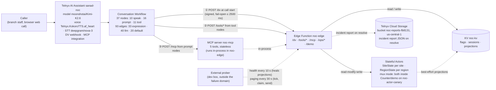

# NOC Front Door — "Sanad", the 24/7 AI fault line of Najd Networks

Najd Networks is a fictional managed-services provider in Saudi Arabia; its customers are **Al-Waha Pharmacies** and **Rawda Cafés**. When a branch network fails, the customer calls one 24/7 AI line — **Sanad** — the NOC's fault line. Sanad verifies the site by PIN, recognises an ongoing regional incident, opens or joins tickets, escalates a regional incident P2→P1 when a third branch is hit, and hands over to the on-call engineer. It runs on Telnyx Voice AI (Conversation Workflows) + Telnyx Edge Compute (Functions, KV, Stateful Actors) + a custom MCP server. Binding design: [`docs/superpowers/specs/2026-09-26-noc-front-door-design.md`](docs/superpowers/specs/2026-09-26-noc-front-door-design.md).

## Use case & users

**The problem.** A KSA managed-services provider's NOC gets outage calls 24/7 from branch staff of enterprise customers — the **Al-Waha Pharmacies** and **Rawda Café** chains. During a regional outage (an ISP or Telnyx event hitting a whole area) every affected branch calls separately, so the NOC queue fills with **duplicate reports** of the same incident, each one a fresh interruption to the engineer on the line.

**The callers.** Branch managers and branch staff at customer sites, phoning in outages and asking for status.

**The receivers.** NOC on-call engineers: they receive **verified** (site + PIN), **de-duplicated** (one ticket per site, reports attached to the regional incident), **prioritised** tickets — P2 for a region, **P1 once a third branch is hit** — and **pages** when a P1 is not acknowledged inside its SLA window.

**What Sanad does.** Verifies the caller by site + PIN, recognises the ongoing regional incident, opens or joins tickets, escalates P2→P1 when a third branch joins, pages the on-call engineer if a P1 is not acknowledged, and hands over to a human on request.

## Try it

Open the **NOC wall**: **https://noc-edge-41d2a334-7.telnyxcompute.com/demo**

- **Left — call Sanad.** **Start call** opens the browser web call (the Trial account has no phone number, DEBUGLOG #1, so demos run as web calls). Keyboard shortcuts: `C` start the call, `B` open the board in a new tab, `1`–`3` jump to a scenario card. Demo PIN chips sit on the scenario cards and copy on click — they are served from the `DEMO_GUIDE` Edge secret, so no PIN literal lives in the code.
- **Right / below — the live board.** Region cards, incidents (P2/P1), open tickets, the escalation column (SLA level + due time / ACKED), KPI tiles and a client-side event feed, fed by **Stateful Actors** and refreshed every 5 s from the cached public `/ops/board` (single-flight with ~8 s reuse, so viewers cannot load the single mux actor).
- **Operator drawer** at the bottom: demo controls from the browser (the ops token stays in this tab's `sessionStorage`, sent only to this site's `/ops` routes) — reset, stage incident, acknowledge, resolve.
- Live status page (raw, masked): **https://noc-edge-41d2a334-7.telnyxcompute.com/ops/status**

**Phone dial-in is NOT MET on the Trial account** — no number can be ordered (KSA origin, no local coverage; DEBUGLOG #1; account-verification request with Telnyx pending since 2026-09-26). The web call above is the substitute; the platform's web-call path is what the brief's "callable" criterion is demonstrated on.

### Live endpoints

| Endpoint | Auth | Notes |
|---|---|---|
| `/demo` | none | NOC wall + call widget + operator drawer (web calls) |
| `/ops/board`, `/ops/status` (JSON, or `?format=html`) | none | Public, read-only views of actor truth (`/ops/board` is single-flight cached) |
| `/dv`, `/tools/verify-site`, `/tools/open-ticket`, `/tools/join-incident`, `/tools/callback` | Ed25519 signature | Called by the assistant at runtime; unsigned request → 403, fail closed |
| `/mcp` | bearer | POST only (`GET` → 405), `401` without a valid bearer; stateless — a new server and transport per request (C4). The MCP bearer is shared privately with reviewers in the submission email (spec §16). Sample: |
| other `/ops/*` (health/deep, reset, stage-incident, ack, resolve, unlock, tick, pages/*, reports/*, actor-ping, diag/race) | ops bearer via `node scripts/ops.mjs` | Operator routes; not published |

```sh
curl -sS -X POST https://noc-edge-41d2a334-7.telnyxcompute.com/mcp \
  -H "Authorization: Bearer $NOC_MCP_TOKEN" -H "content-type: application/json" \
  -d '{"jsonrpc":"2.0","id":1,"method":"initialize","params":{"protocolVersion":"2024-11-05","capabilities":{},"clientInfo":{"name":"reviewer","version":"0.0.0"}}}'
# then, identically, {"jsonrpc":"2.0","id":2,"method":"tools/list"} → 5 tools
```

Reviewer credentials (fictional demo sites, published intentionally for reviewers):

| Site | Region | PIN | Scenario |
|---|---|---|---|
| RUH-114 — "the Al Yasmin branch" | Riyadh North | 5944 | Incident scenario |
| JED-007 | Jeddah | 7985 | Fresh ticket |

Three scripted scenarios:

1. **Join the Riyadh North incident** — call as RUH-114/5944 during a staged 2-site incident: a deterministic spoken advisory, then join, and the incident is upgraded to P1 when a third branch is hit (watch it live on `/ops/status`).
2. **Lockout — use the reserved site DMM-011**: say **site D M M zero one one**, then give a wrong PIN three times → the call is locked for phone verification → escalation to an engineer. Never run this on RUH-114/JED-007: six failures from two calls lock a site's PIN verification **site-wide for 15 minutes**, which would block scenario 1 for everyone.
3. **Ask for a human** → transfer to the on-call engineer; if unreachable, leave a callback message (logged, page raised).

One-shot note: scenario 1 is **one-shot per staging** — once RUH-114 has joined and the incident is P1, later callers only attach to the existing incident. Re-stage with the operator drawer (or `/ops/reset` + `/ops/stage-incident`) before each fresh run-through; `RegionState` also ignores reports older than 6 h, so stage right before the demo.

Note: calls are recorded and handled by an AI assistant. The operator resets and stages the demo with `POST /ops/reset` then `POST /ops/stage-incident` (spec §16 pre-flight; the operator drawer does this from the page); `RegionState` ignores reports older than 6 h, so stage right before the demo. The **external prober must be running**: its 10 s deep-health probes heal the KV incident projections (without it the projection expires after its 2 h TTL and the board shows nothing — DEBUGLOG #11), and its 30 s paging cycle is what claims and "sends" alarm pages (see [runbook](docs/runbook.md)).

## Architecture



- **Actors own the invariants.** One ticket per site (`SiteState`) and incident declaration / P1 escalation at 3 sites (`RegionState`) are read-modify-write over shared state. Actor turns are single-threaded and commit atomically (C6), so 10 concurrent opens for one site produce **exactly 1 ticket** — [`docs/evidence/race-test.txt`](docs/evidence/race-test.txt): actor mode created 1 (`NJD-9902`), KV mode created 10 duplicates (an earlier inconclusive run under the old 1500 ms race deadline is in DEBUGLOG #6).
- **KV is only a projection / cache / flags.** It is last-write-wins with no compare-and-swap (C5), so no invariant ever lives there: the incident projection is re-synced from actor truth (best-effort), sessions are TTL'd blind puts, flags are just slow config.
- **Per-entity topology.** `edge/noc-actors` declares the actor classes with no bindings (the owner); `noc-edge` binds them by reference and holds every secret — least privilege (probe P0-2e).
- **Mux-mode contingency.** New actor instances cannot activate on this Trial account (DEBUGLOG #4), so the KV flag `flag/actor_mode=mux` runs the **same** `SiteState`/`RegionState` classes inside the one working instance (`Counter/demo` on noc-actor-canary, shipped as `edge/noc-actor-host`), switched through one `ActorPort` interface with zero business-logic change.
- **Fail-open by design.** `/dv` answers within a hard budget (2500 ms platform timeout); if KV or actors are slow it falls back to safe defaults (`route_hint=unverified` → PIN verification) — the call still works (proven live in DEBUGLOG #8).

## Setup from scratch

Prerequisites: a Telnyx account + API key (a Trial is fine), the [`telnyx-edge` CLI](https://telnyx.com/products/edge-infra), **Node 22**, and — for authoring — [OpenCode](https://opencode.ai) with the `@telnyx/opencode` plugin (see `opencode.jsonc`).

1. **Install dependencies** — one `npm ci` per package:
   ```sh
   npm ci && npm --prefix edge/shared ci && npm --prefix edge/noc-actors ci && npm --prefix edge/noc-edge ci && npm --prefix edge/noc-actor-host ci
   ```
2. **`.env`** — `cp .env.example .env`, then fill in every key:
   - `TELNYX_API_KEY` — the API key for the Voice AI and Edge Compute APIs (required).
   - `MCP_TOKEN` — the bearer the assistant's MCP calls send (generated by setup-edge.sh if empty).
   - `OPS_TOKEN` — the bearer for the operator `/ops/*` routes (generated if empty).
   - `PIN_PEPPER` — pepper for PIN fingerprints; never logged or committed (generated if empty).
   - `NOC_OPS_TOKEN` — same value as `OPS_TOKEN`, used by OpenCode's `noc-mcp` entry.
   - `TELNYX_PUBLIC_KEY` — the account public key used to verify Ed25519 webhook signatures (fetched by setup-edge.sh if empty).
   - `EDGE_URL` — the deployed `noc-edge` origin; every script (prober, ops.mjs, apply, race-test) reads it.
   - `ONCALL_NUMBER` — the on-call engineer's E.164 transfer destination; required by `scripts/apply.mjs` (empty is fine for `--dry-run`).
3. **`bash scripts/setup-edge.sh`** — idempotent: creates/verifies the **KV namespace `noc-kv`** (polls readiness, prints `KV_NAMESPACE_ID`), generates `MCP_TOKEN`/`OPS_TOKEN`/`PIN_PEPPER` if missing, fetches `TELNYX_PUBLIC_KEY`, writes the generated values back to `.env`, and pushes the four Edge secrets.
4. **Per-function secrets** — `edge/noc-edge/telnyx.toml` declares seven `[[secrets]]` bindings; setup-edge.sh pushes `TELNYX_PUBLIC_KEY`, `MCP_TOKEN`, `OPS_TOKEN`, `PIN_PEPPER` (account-scoped; `OPS_TOKEN` is also bound in `edge/noc-actor-host/telnyx.toml`). Add the remaining three with `telnyx-edge secrets add <NAME> <value>`:
   - `ONCALL_NUMBER` — the verified on-call number Sanad transfers to.
   - `SEED_LOCAL` — JSON with the demo PINs and contact phone numbers; the committed seed carries no secrets, PINs live only here.
   - `DEMO_GUIDE` — the scenario copy + PIN chips served on `/demo`, so no PIN literal exists in code.
5. **Telnyx Cloud Storage** — create an S3-compatible **bucket in `us-central-1`** (this deployment: `noc-reports-fb8131`) and set `bucket_name` + `region` under `[storage.cloudstorage.REPORTS]` in `edge/noc-edge/telnyx.toml`.
6. **Ship the functions** in order owner → mux host → edge: run `telnyx-edge ship` inside `edge/noc-actors`, then `edge/noc-actor-host`, then `edge/noc-edge`. Each deploy builds client-side and takes **15–35 min**.
7. **Set the mux flag** on accounts affected by DEBUGLOG #4 (new actor instances cannot activate): `telnyx-edge storage kv key put "$KV_ID" flag/actor_mode mux` (`$KV_ID` is the namespace id from step 3; verify with `node scripts/ops.mjs GET '/ops/actor-ping?site=TST-001'` → `mode`).
8. **Apply the assistant** (config-as-code; `sanad-noc` is PATCHed in place, never deleted): dry-run first, then apply —
   ```sh
   EDGE_URL=<origin> node scripts/apply.mjs --dry-run
   EDGE_URL=<origin> node scripts/apply.mjs
   ```
   It creates the `noc_mcp_token` integration secret, the `noc-mcp` MCP server and the 5 tools, then PATCHes the assistant and prints read-back `DRIFT` lines (empty output = clean).
9. **Start the prober** — it is the heal loop and the paging driver, so keep it running: `node scripts/prober.mjs` (or `nohup node scripts/prober.mjs > prober.log 2>&1 &`).
10. **Pre-flight**: `node scripts/ops.mjs POST /ops/reset`, then `node scripts/ops.mjs POST '/ops/stage-incident?region=riyadh-north'` — the board shows the staged P2 with escalation due in 5 min.

## Code walkthrough

Eight ordered stops, each `file:lines — what to show — why it matters`:

1. **Config-as-code** — `assistant/assistant.json` (the 37-node flow: 10 speak · 16 prompt · 11 tool, 93 edges: 33 expression · 40 llm · 20 default) + `scripts/apply.mjs:61-296` — validates with `scripts/lib/flow-validate.mjs:34-275` before any API call, creates the integration secret → MCP server → tools, then PATCHes `sanad-noc` in place and prints read-back `DRIFT`. The assistant is code; every node sets `instructions_mode`/`tools_mode` explicitly (C7).
2. **`/dv` — signed, fail-open, concurrent** — `edge/noc-edge/src/dv/handler.ts:145-412`: Ed25519 verify + freshness at `:159-168` (unsigned → 403), safe-default flags `SAFE_FLAGS` `:24-30`, fail-open response `:105-143`, flags + directory read concurrently with unioned KV spans `:246-306`, projection read `:414-432`. The webhook that blocks the greeting must never be the reason a call fails (C3).
3. **Tool webhooks — identity from the signed body** — `edge/noc-edge/src/tools/verifySite.ts:62-203` + `tools/common.ts:173-268`: `prelude` verifies the signature (403 fail closed) and takes the call identity from the signed body — `call_control_id` / `call_key` (`common.ts:226-235`), never a header alone and never LLM-supplied arguments (C13); `verifySite` then runs the PIN check + actor attempt and the post-verify KV reads concurrently.
4. **`SiteState` — one ticket per site, PIN lock** — `edge/noc-actors/src/SiteState.ts:229-310`: `recordPinAttempt` — once a call hits 3 failures it stays locked for the rest of the call even with the correct PIN (`:259-274`), and 6 failures from 2 distinct calls lock the whole site for 15 min (`:284-297`); `:330-416`: `openOrAttach` — dedupe cache, creates the ticket once, attaches/note on repeats. Invariants live in single-threaded actor turns (C6).
5. **`RegionState` — regional incident + escalation** — `edge/noc-actors/src/RegionState.ts:169-281`: `reportSite` declares a P2 at the second distinct branch and upgrades to P1 at the third, re-arming the alarm; `:507-545`: `escalateIfDue` walks the SLA ladder L1→L3, mints `INC-<id>:p<seq>` pages and re-arms until max level. This is what the board and the pages come from.
6. **Mux host — the DEBUGLOG #4 contingency** — `edge/noc-actor-host/src/MuxHost.ts:52-103,105-156`: the same `SiteState`/`RegionState` classes multiplexed inside the one working `Counter` instance (method allow-lists `:17-42`, `dispatch` `:164-179`), the single real platform alarm fanned out to entities (`alarm`/`tick` → `fanOut`, delete-first `:105-142`) and re-armed (`reconcileAlarm`, `:147-156`). Zero business-logic change between per-entity and mux.
7. **MCP — stateless, two bearer scopes** — `edge/noc-edge/src/mcp/server.ts:129-209`: the scope comes from the bearer (`mcp/shim.ts:7-18`), `session`-scope tools resolve the session from the conversation, `ops` scope cannot touch conversation sessions; a fresh `McpServer` + transport per request (`:187-201`, C4). The 5 tools are registered with zod schemas in `mcp/tools.ts:56-92`.
8. **Observability** — `edge/noc-edge/src/ops/health.ts:224-282`: `runDeepHealth` runs the kv/actor/mcp/sync checks concurrently, each with a 4 s deadline; a `configCheck` fails on a missing/invalid call-path secret; a timed-out check is `slow`, not down. Plus `scripts/prober.mjs:53-83,254-343`: the 10 s probe loop (alert after 2 consecutive failures) and the 30 s paging cycle (tick → pending → claim → banner → sent). "Know within a minute" in code, not claims.

## Requirements map

| Brief requirement | Where it lives | Live evidence |
|---|---|---|
| Conversation Workflow: prompt / speak / tool nodes, `llm` / `expression` / `default` edges | `assistant/assistant.json` (37 nodes, 93 edges: 33 expression, 40 LLM, 20 default — the English core + the 13-node Arabic sub-flow) + `scripts/apply.mjs`, `scripts/lib/flow-validate.mjs` | Applied live 2026-09-27, read-back zero DRIFT (DEBUGLOG #7); Arabic mode applied live 2026-09-28 00:18 UTC+3 (per-node voice/STT overrides accepted); voice calls #2/#3 in [`docs/evidence/voice-calls.md`](docs/evidence/voice-calls.md) |
| Callable — web call + `/demo` | `edge/noc-edge/src/demo/page.ts` (@telnyx/ai-agent-widget 0.36.0) | https://noc-edge-41d2a334-7.telnyxcompute.com/demo (phone blocked on Trial — DEBUGLOG #1) |
| Custom MCP server, ≥3 tools | `edge/noc-edge/src/mcp/` — 5 tools, two bearer scopes, stateless (C4) | Live initialize + tools/list = 5 tools; chat smoke finding (DEBUGLOG #9) |
| Dynamic-variables webhook from an Edge Function, influencing routing | `edge/noc-edge/src/dv/` — `route_hint` drives `s_open`'s expression edges | Webhook live and signed; on anonymous web calls it answers **safe defaults** within budget (KV latency, DEBUGLOG #6; platform delivery measured 3/5 web calls — P0-3a). Identified routing proven in unit tests and via `flag/demo_caller` (see the demo-call toggles in the runbook) |
| Edge Functions | `edge/noc-edge/telnyx.toml` + `src/router.ts`; actors in `edge/noc-actors/`, `edge/noc-actor-host/` | Live 2026-09-27: `/ops/status` 200, unsigned `/dv` 403, `/mcp` 401 + GET 405 (DEBUGLOG #4, update 2026-09-27) |
| KV | `edge/noc-edge/src/services/{kvPort,flags,directory}.ts`; keys in `edge/shared/src/kvkeys.ts` | Flags live (`deflection_enabled`, `require_pin`, `actor_mode`, `flag/fault/*`); latency finding (DEBUGLOG #6) |
| Stateful Actors with read-modify-write | `edge/noc-actors/src/{SiteState,RegionState}.ts`; mux host `edge/noc-actor-host/src/MuxHost.ts`; unit-tested on fakes (C11) | `/ops/actor-ping` → mux, pong 220 ms; [`docs/evidence/race-test.txt`](docs/evidence/race-test.txt) (run in mux mode): 10 concurrent opens → actor 1 ticket vs KV 10 |
| Structured logs (one JSON line: `{ts, lvl, svc, hop, evt, trace_id, …, total_ms, outcome}`) | `edge/shared/src/log.ts`, `edge/noc-edge/src/log.ts` | `scripts/trace.sh` over live logs; runbook §2–3 |
| A signal beyond logs | `scripts/prober.mjs`, `GET /ops/status`, `GET /ops/health/deep` | Prober alerting + degraded≠down semantics (docs/runbook.md §1) |
| "Know within a minute" answer | `scripts/prober.mjs` — 10 s interval, 2 consecutive failures ≈ ≤30 s worst case (edge-function outages: KV, actors, MCP server, config; assistant-level failures surface in the Portal + `trace.sh`, see below) | docs/runbook.md |
| A real debugging story | `DEBUGLOG.md` #5–#14 | KV latency found by our own logs within a minute (#5); the voice-call failure chain (#8); review catches #13–#14 |
| OpenCode + Telnyx Inference as the coding model | `opencode.jsonc`, `AGENTS.md` | [`DOGFOODING.md`](DOGFOODING.md): 57 OpenCode-authored commits (`git log --grep 'Assisted-by: OpenCode'`), ≈$0.25–0.30 per run |
| Public deployment | https://noc-edge-41d2a334-7.telnyxcompute.com (`/demo`, `/ops/status`) | Live since 2026-09-27 |
| Docs | `README.md`, `docs/runbook.md`, `DEBUGLOG.md`, `DOGFOODING.md`, `docs/evidence/` | This repo |

## Stretch goals

| Status | Goal | Evidence |
|---|---|---|
| Built & live | Variable-comparison edges — 19 expression edges in the English core (33 across the full flow), incl. `telnyx_conversation_duration_secs` escalation (DUR) and `telnyx_last_tool_status_code` routing | `assistant/assistant.json`; P1 upgrade at 3 sites live (voice call #3) |
| Built & live | Custom DV webhook — live, signed; `route_hint` drives the opening for identified callers | `edge/noc-edge/src/dv/`; on anonymous web calls it answers safe defaults within budget (KV latency, DEBUGLOG #6; DEBUGLOG #8 fallback); identified routing proven in unit tests + `flag/demo_caller` (runbook) |
| Built & live | KV feature flags — `deflection_enabled`, `require_pin`, `demo_caller`, fault injection `flag/fault/*`, `actor_mode` | `edge/noc-edge/src/services/flags.ts`; fault-injection drills (docs/runbook.md) |
| Built & live | Shared actors — one working actor instance used by two functions | `edge/noc-actors` owner + reference binders (`noc-edge`, `noc-actor-host`); `/ops/actor-ping` |
| Built & live | Distributed tracing — one `trace_id` from `/dv` through tools, MCP and actors | `scripts/trace.sh`; runbook §3 |
| Built & live | Actor alarms — SLA escalation ladder in `RegionState`; the mux host fans the single real alarm out to entities (`/ops/tick` is only the fallback) | LIVE: INC-1004 escalated to L1 at 21:51:4xZ and page `INC-1004:p1` was claimed and "sent" by the prober at 21:51:53Z — every `/ops/tick` in that window reported `fired:0`, so the **platform alarm** fired ([docs/evidence/alarms-live.md](docs/evidence/alarms-live.md), all times UTC) |
| Built, deploy pending | Object-storage incident reports — report JSON written to Telnyx Cloud Storage bucket `noc-reports-fb8131` on resolve; ops-token routes `/ops/reports` and `/ops/reports/<key>`; the board carries `last_report` | No live report write recorded yet (fix round after the review, see DEBUGLOG #13) |
| Built, config live (no Arabic call recorded yet) | Arabic mode — a Saudi-Arabic sub-flow (13 nodes) inside the single Trial assistant: per-node voice `Telnyx.Bayan.Reem` + STT `soniox/stt-rt-v5`, deterministic tool-node exits | Assistant applied live 2026-09-28 00:18 UTC+3 (37 nodes / 93 edges); the API accepted the per-node config — no Arabic call has been recorded yet; a true **second assistant** needs a higher assistant limit (asked Telnyx) |
| Built & live | Live NOC console — the `/demo` NOC wall above (dark, Langfuse-style; live board, operator drawer) | LIVE 2026-09-27 23:28 UTC+3, verified in headless Chromium; [edge/noc-edge/src/demo/page.ts](edge/noc-edge/src/demo/page.ts) |
| Evaluation pending (A/B by live calls) | Voice-model upgrade — TTS "Ultra" voices shortlisted, STT candidate `deepgram/flux` vs current nova-3 | P2-6 prep: A/B needs Fahad's voice calls (no credit spent) |

## How would you know within a minute that it's broken?

**Short answer — scoped honestly.** The external prober on the dev box (outside the failure domain) probes `GET /ops/health/deep` every 10 s and alerts after **2 consecutive failures** — worst case ≈ 30 s (outage starts just after a good probe → failure 1 by ~18 s → failure 2 by ~28 s → banner). That check covers the **edge function and its dependencies**: KV, the Stateful Actors, the in-process MCP server, and the incident-projection sync. It does **not** exercise the assistant itself: the signed `/dv` and `/tools/*` paths, the public `/mcp` bearer, or assistant-config drift. Those assistant-level failures surface instead in the Portal conversation (node labels), the invocation log and the per-call trace — that is the second look in the runbook. A `degraded` result (slow KV, `slow:["kv"]`) is **not** an outage: it appears in the minute summary and does not alert (DEBUGLOG #6).

**What to look at first:** the invocation log (`telnyx-edge logs noc-edge --tail --type invocations`), then the per-call trace (`scripts/trace.sh t-<trace_id>`), then the Portal conversation's node labels — the full order and commands are in [`docs/runbook.md`](docs/runbook.md).

## A real debugging story

At 17:10 UTC on 2026-09-27 a live voice call (trace `t-5d419f3a98a3240f`) hit the happy path and broke it: the caller's PIN was **correct** — `verify_site` returned `verify_result "ok"` — but the tool took **7869 ms**, over its 5000 ms timeout. Telnyx therefore treated verification as *failed*: the workflow left `t_verify` on the default edge and ran the designed escalation path — transfer (unanswered) → take a message → `log_callback` (2.8 s, page raised). The call ended safely, but no ticket was opened. Tracing by `trace_id` also showed the DV webhook had fallen back at 2200 ms (`kv` 2195), so the call opened with the static default greeting — the designed fail-open path (spec §5.4); the opener is static regardless, so no personalisation was expected on an anonymous web call.

Root cause (DEBUGLOG #6): a KV operation costs ~1.1 s (REST) to 1.3–2.0 s (edge) on this account, and the tool webhooks ran their KV work strictly in sequence — the happy path was not latency-shaped. Fix: concurrent KV inside the tools (verify_site 5428→2010 ms, open_ticket 4830→1618 ms under a 1000 ms/op fake KV) plus a verify timeout raised 5000→8000 ms as a safety net.

Proof: call #2 (18:05 UTC, `t-128d0766…`) verified in **3579 ms** and joined the incident (`join_incident` 2638 ms → NJD-1401). Call #3 (18:14 UTC, `t-c01949fafca2a42e`) verified in 3646 ms, joined in 2559 ms → NJD-1402, and INC-1002 went **P1 at 3 sites**, confirmed on `/ops/status`. The core demo path is proven live over voice — full table in [`docs/evidence/voice-calls.md`](docs/evidence/voice-calls.md).

## How it was built

Every shipped artifact — code, config, tests, scripts, README, demo — is authored through **OpenCode on Telnyx Inference** (`telnyx/zai-org/GLM-5.3-Flash` default; other models per task). Claude acts as architect and reviewer: it writes the spec, the plans and the task prompts, and every implementer task is independently reviewed before merge. [`DOGFOODING.md`](DOGFOODING.md) records the per-task cost, the review findings the process caught, and what worked vs. what didn't.

**Exceptions (all `git log --grep "Co-Authored-By: Claude"`):** besides the docs (spec, plans, AGENTS.md), two code-bearing groups are Claude-co-authored: (1) the CLI-generated scaffolds committed by the architect — `1465810` (noc-actors/noc-edge/shared: `package.json`, lockfiles, `telnyx.toml`, `tsconfig`, the scaffold READMEs), `aaec5bf`/`3eab224`/`37df71d` (the noc-probe scaffold, its dep pins and the KV id); (2) the `/demo` page's visual layer (`edge/noc-edge/src/demo/page.ts` + its tests): the Langfuse-style wall (`bf53117`) and its three follow-up fixes (`05159c6`, `ae2feac`, `277f439` — announcement bar, shortcuts, SRI + the DMM-011 lockout scenario + Unlock drawer action), designed and written by **Claude** at the product owner's request, after two OpenCode-built versions (GLM-5.3, then Kimi-K3) were rejected as looking generic (P2-R5/P2-R8). The board endpoint behind it (`/ops/board`, `services/board.ts`, `demo/guide.ts`, the router) is OpenCode-authored. This split is disclosed in the commits, the page's source comment and DOGFOODING.md.

## Repo layout

```
assistant/            Assistant-as-code: 37-node workflow (English + Arabic mode), tools, MCP server, instructions; applied by scripts/apply.mjs
edge/noc-edge/        The Edge Function: /dv, /tools/*, /mcp, /ops/*, /demo; services (flags, directory, sessions, incidents, tickets); ActorPort seam
edge/noc-actors/      Stateful Actor classes SiteState + RegionState (binding-free owner)
edge/noc-actor-host/  Mux-mode host: the same SiteState/RegionState classes inside the one working actor instance (Counter/demo)
edge/noc-probe/       Plan-0 diagnostics probe (kept for reference; DEBUGLOG #2–#4 experiments)
edge/shared/          Pure libs: ids, KV keys, deadline(), Ed25519 verify, logging, masking, authz, ITSM seed adapter
scripts/              apply.mjs (config-as-code), prober.mjs, ops.mjs (one-off ops calls), trace.sh, race-test.mjs, preflight.mjs, secret-scan
docs/                 Spec, plans, runbook, evidence (probe results, voice calls, live alarm test)
```

### Run the tests

```sh
npm test                              # root: apply/flow-validate/prober/ops/secret-scan (139 tests)
npm --prefix edge/shared test         # 161
npm --prefix edge/noc-actors test     # 65
npm --prefix edge/noc-edge test       # 406
npm --prefix edge/noc-actor-host test # 28
```

### Deploy

```sh
# edge functions, one ship per function (builds client-side, 15–35 min deploy):
telnyx-edge ship    # run in edge/noc-edge, edge/noc-actors, edge/noc-actor-host
# assistant config-as-code — PATCH in place, the assistant is never deleted:
EDGE_URL=https://noc-edge-41d2a334-7.telnyxcompute.com node scripts/apply.mjs
```

### Known platform issues (this Trial account)

- **DEBUGLOG #1** — no phone number can be ordered on the Trial account (KSA origin, no local coverage): demos are web calls.
- **DEBUGLOG #4** — new actor instances cannot activate: all actor state runs in the mux host behind `flag/actor_mode=mux`; `/ops/actor-ping` shows the active mode.
- **DEBUGLOG #6** — KV reads cost ~1.1–2.0 s per op: routes are latency-shaped, `/ops/health/deep` may report `degraded`, which is not an outage.
- **DEBUGLOG #11** — the KV incident projection expires after its 2 h TTL; the prober's deep-health sync is the heal loop → **keep the prober running** (runbook §6).
- **DEBUGLOG #12** — actor alarms **do work** on this account although new instances cannot be created: the host's own (pre-existing) alarm fires and is fanned out to entities (DEBUGLOG #4 context, [evidence](docs/evidence/alarms-live.md)).
