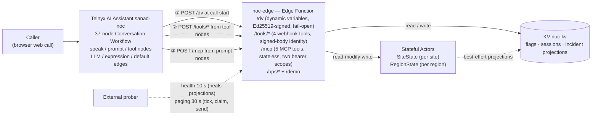

# NOC Front Door — "Sanad", the 24/7 AI fault line of Najd Networks

Najd Networks is a fictional managed-services provider in Saudi Arabia; its customers are **Al-Waha Pharmacies** and **Rawda Cafés**. When a branch network fails, the customer calls one 24/7 AI line — **Sanad** — the NOC's fault line. Sanad verifies the site by PIN, recognises an ongoing regional incident, opens or joins tickets, escalates a regional incident P2→P1 when a third branch is hit, and hands over to the on-call engineer. It runs on Telnyx Voice AI (Conversation Workflows) + Telnyx Edge Compute (Functions, KV, Stateful Actors) + a custom MCP server. Binding design: [`docs/superpowers/specs/2026-09-26-noc-front-door-design.md`](docs/superpowers/specs/2026-09-26-noc-front-door-design.md).

## Try it

Open the **NOC wall**: **https://noc-edge-41d2a334-7.telnyxcompute.com/demo**

- **Left — call Sanad.** **Start call** opens the browser web call (the Trial account has no phone number, DEBUGLOG #1, so demos run as web calls). Keyboard shortcuts: `C` start the call, `B` open the board in a new tab, `1`–`3` jump to a scenario card. Demo PIN chips sit on the scenario cards and copy on click — they are served from the `DEMO_GUIDE` Edge secret, so no PIN literal lives in the code.
- **Right / below — the live board.** Region cards, incidents (P2/P1), open tickets, the escalation column (SLA level + due time / ACKED), KPI tiles and a client-side event feed, fed by **Stateful Actors** and refreshed every 5 s from the cached public `/ops/board` (single-flight with ~8 s reuse, so viewers cannot load the single mux actor).
- **Operator drawer** at the bottom: demo controls from the browser (the ops token stays in this tab's `sessionStorage`, sent only to this site's `/ops` routes) — reset, stage incident, acknowledge, resolve.
- Live status page (raw, masked): **https://noc-edge-41d2a334-7.telnyxcompute.com/ops/status**

Reviewer credentials (fictional demo sites, published intentionally for reviewers):

| Site | Region | PIN | Scenario |
|---|---|---|---|
| RUH-114 — "the Al Yasmin branch" | Riyadh North | 5944 | Incident scenario |
| JED-007 | Jeddah | 7985 | Fresh ticket |

Three scripted scenarios:

1. **Join the Riyadh North incident** — call as RUH-114/5944 during a staged 2-site incident: a deterministic spoken advisory, then join, and the incident is upgraded to P1 when a third branch is hit (watch it live on `/ops/status`).
2. **Wrong PIN three times** → the call is locked for phone verification → escalation to an engineer.
3. **Ask for a human** → transfer to the on-call engineer; if unreachable, leave a callback message (logged, page raised).

Note: calls are recorded and handled by an AI assistant. The operator resets and stages the demo with `POST /ops/reset` then `POST /ops/stage-incident` (spec §16 pre-flight; the operator drawer does this from the page); `RegionState` ignores reports older than 6 h, so stage right before the demo. The **external prober must be running**: its 10 s deep-health probes heal the KV incident projections (without it the projection expires after its 2 h TTL and the board shows nothing — DEBUGLOG #11), and its 30 s paging cycle is what claims and "sends" alarm pages (see [runbook](docs/runbook.md)).

## Architecture



- **Actors own the invariants.** One ticket per site (`SiteState`) and incident declaration / P1 escalation at 3 sites (`RegionState`) are read-modify-write over shared state. Actor turns are single-threaded and commit atomically (C6), so 10 concurrent opens for one site produce **exactly 1 ticket** — [`docs/evidence/race-test.txt`](docs/evidence/race-test.txt): actor mode created 1 (`NJD-9902`), KV mode created 10 duplicates (an earlier inconclusive run under the old 1500 ms race deadline is in DEBUGLOG #6).
- **KV is only a projection / cache / flags.** It is last-write-wins with no compare-and-swap (C5), so no invariant ever lives there: the incident projection is re-synced from actor truth (best-effort), sessions are TTL'd blind puts, flags are just slow config.
- **Per-entity topology.** `edge/noc-actors` declares the actor classes with no bindings (the owner); `noc-edge` binds them by reference and holds every secret — least privilege (probe P0-2e).
- **Mux-mode contingency.** New actor instances cannot activate on this Trial account (DEBUGLOG #4), so the KV flag `flag/actor_mode=mux` runs the **same** `SiteState`/`RegionState` classes inside the one working instance (`Counter/demo` on noc-actor-canary, shipped as `edge/noc-actor-host`), switched through one `ActorPort` interface with zero business-logic change.
- **Fail-open by design.** `/dv` answers within a hard budget (2500 ms platform timeout); if KV or actors are slow it falls back to safe defaults (`route_hint=unverified` → PIN verification) — the call still works (proven live in DEBUGLOG #8).

## Requirements map

| Brief requirement | Where it lives | Live evidence |
|---|---|---|
| Conversation Workflow: prompt / speak / tool nodes, `llm` / `expression` / `default` edges | `assistant/assistant.json` (37 nodes, 93 edges: 33 expression, 40 LLM, 20 default — the English core + the 13-node Arabic sub-flow) + `scripts/apply.mjs`, `scripts/lib/flow-validate.mjs` | Applied live 2026-09-27, read-back zero DRIFT (DEBUGLOG #7); Arabic mode applied live 00:18 (per-node voice/STT overrides accepted); voice calls #2/#3 in [`docs/evidence/voice-calls.md`](docs/evidence/voice-calls.md) |
| Callable — web call + `/demo` | `edge/noc-edge/src/demo/page.ts` (@telnyx/ai-agent-widget 0.36.0) | https://noc-edge-41d2a334-7.telnyxcompute.com/demo (phone blocked on Trial — DEBUGLOG #1) |
| Custom MCP server, ≥3 tools | `edge/noc-edge/src/mcp/` — 5 tools, two bearer scopes, stateless (C4) | Live initialize + tools/list = 5 tools; chat smoke finding (DEBUGLOG #9) |
| Dynamic-variables webhook from an Edge Function, influencing routing | `edge/noc-edge/src/dv/` — `route_hint` drives `s_open`'s expression edges | Defaults path proven live: DV fell back at 2200 ms on voice call #1 (DEBUGLOG #8) |
| Edge Functions | `edge/noc-edge/telnyx.toml` + `src/router.ts`; actors in `edge/noc-actors/`, `edge/noc-actor-host/` | Live 2026-09-27: `/ops/status` 200, unsigned `/dv` 403, `/mcp` 401 + GET 405 (DEBUGLOG #4 update) |
| KV | `edge/noc-edge/src/services/{kvPort,flags,directory}.ts`; keys in `edge/shared/src/kvkeys.ts` | Flags live (`deflection_enabled`, `require_pin`, `actor_mode`, `flag/fault/*`); latency finding (DEBUGLOG #6) |
| Stateful Actors with read-modify-write | `edge/noc-actors/src/{SiteState,RegionState}.ts`; mux host `edge/noc-actor-host/src/MuxHost.ts`; unit-tested on fakes (C11) | `/ops/actor-ping` → mux, pong 220 ms; [`docs/evidence/race-test.txt`](docs/evidence/race-test.txt): 10 concurrent opens → actor 1 ticket vs KV 10 |
| Structured logs (one JSON line: `{ts, lvl, svc, hop, evt, trace_id, …, total_ms, outcome}`) | `edge/shared/src/log.ts`, `edge/noc-edge/src/log.ts` | `scripts/trace.sh` over live logs; runbook §2–3 |
| A signal beyond logs | `scripts/prober.mjs`, `GET /ops/status`, `GET /ops/health/deep` | Prober alerting + degraded≠down semantics (docs/runbook.md §1) |
| "Know within a minute" answer | `scripts/prober.mjs` — 10 s interval, 2 consecutive failures ≈ ≤30 s worst case | docs/runbook.md |
| A real debugging story | `DEBUGLOG.md` #5–#14 | KV latency found by our own logs within a minute (#5); the voice-call failure chain (#8); review catches #13–#14 |
| OpenCode + Telnyx Inference as the coding model | `opencode.jsonc`, `AGENTS.md` | [`DOGFOODING.md`](DOGFOODING.md): 41 OpenCode-authored commits, ≈$0.25–0.30 per run |
| Public deployment | https://noc-edge-41d2a334-7.telnyxcompute.com (`/demo`, `/ops/status`) | Live since 2026-09-27 |
| Docs | `README.md`, `docs/runbook.md`, `DEBUGLOG.md`, `DOGFOODING.md`, `docs/evidence/` | This repo |

## Stretch goals

| Status | Goal | Evidence |
|---|---|---|
| Built & live | Variable-comparison edges — 18 expression edges, incl. `telnyx_conversation_duration_secs` escalation (DUR) and `telnyx_last_tool_status_code` routing | `assistant/assistant.json`; P1 upgrade at 3 sites live (voice call #3) |
| Built & live | Custom DV webhook (`route_hint` drives the opening) | `edge/noc-edge/src/dv/`; defaults path live (DEBUGLOG #8) |
| Built & live | KV feature flags — `deflection_enabled`, `require_pin`, `demo_caller`, fault injection `flag/fault/*`, `actor_mode` | `edge/noc-edge/src/services/flags.ts`; fault-injection drills (docs/runbook.md) |
| Built & live | Shared actors — one working actor instance used by two functions | `edge/noc-actors` owner + reference binders (`noc-edge`, `noc-actor-host`); `/ops/actor-ping` |
| Built & live | Distributed tracing — one `trace_id` from `/dv` through tools, MCP and actors | `scripts/trace.sh`; runbook §3 |
| Built & live | Actor alarms — SLA escalation ladder in `RegionState`; the mux host fans the single real alarm out to entities (`/ops/tick` is only the fallback) | LIVE: INC-1004 escalated to L1 at 00:51 and page `INC-1004:p1` was claimed and "sent" by the prober at 00:51:53 — every `/ops/tick` in that window reported `fired:0`, so the **platform alarm** fired ([docs/evidence/alarms-live.md](docs/evidence/alarms-live.md)) |
| Built, deploy pending | Object-storage incident reports — report JSON written to Telnyx Cloud Storage bucket `noc-reports-fb8131` on resolve; ops-token routes `/ops/reports` and `/ops/reports/<key>`; the board carries `last_report` | No live report write recorded yet (fix round after the review, see DEBUGLOG #13) |
| Built & live (as Arabic mode) | Arabic mode — a Saudi-Arabic sub-flow (13 nodes) inside the single Trial assistant: per-node voice `Telnyx.Bayan.Reem` + STT `soniox/stt-rt-v5`, deterministic tool-node exits | Assistant applied live 00:18 (37 nodes / 93 edges); a true **second assistant** needs a higher assistant limit (asked Telnyx) |
| Built & live | Live NOC console — the `/demo` NOC wall above (dark, Langfuse-style; live board, operator drawer) | LIVE 23:28, verified in headless Chromium; [edge/noc-edge/src/demo/page.ts](edge/noc-edge/src/demo/page.ts) |
| Evaluation pending (A/B by live calls) | Voice-model upgrade — TTS "Ultra" voices shortlisted, STT candidate `deepgram/flux` vs current nova-3 | P2-6 prep: A/B needs Fahad's voice calls (no credit spent) |

## How would you know within a minute that it's broken?

**Short answer:** an external prober on the dev box (outside the failure domain) probes `GET /ops/health/deep` every 10 s and alerts after **2 consecutive failures** — worst case ≈ 30 s (outage starts just after a good probe → failure 1 by ~18 s → failure 2 by ~28 s → banner). A `degraded` result (slow KV, `slow:["kv"]`) is **not** an outage: it appears in the minute summary and does not alert (DEBUGLOG #6).

**What to look at first:** the invocation log (`telnyx-edge logs noc-edge --tail --type invocations`), then the per-call trace (`scripts/trace.sh t-<trace_id>`), then the Portal conversation's node labels — the full order and commands are in [`docs/runbook.md`](docs/runbook.md).

## A real debugging story

At 17:10 UTC on 2026-09-27 a live voice call (trace `t-5d419f3a98a3240f`) hit the happy path and broke it: the caller's PIN was **correct** — `verify_site` returned `verify_result "ok"` — but the tool took **7869 ms**, over its 5000 ms timeout. Telnyx therefore treated verification as *failed*: the workflow left `t_verify` on the default edge and ran the designed escalation path — transfer (unanswered) → take a message → `log_callback` (2.8 s, page raised). The call ended safely, but no ticket was opened. Tracing by `trace_id` also showed the DV webhook had fallen back at 2200 ms (`kv` 2195), so the call opened with a generic greeting instead of a personal one.

Root cause (DEBUGLOG #6): a KV operation costs ~1.1 s (REST) to 1.3–2.0 s (edge) on this account, and the tool webhooks ran their KV work strictly in sequence — the happy path was not latency-shaped. Fix: concurrent KV inside the tools (verify_site 5428→2010 ms, open_ticket 4830→1618 ms under a 1000 ms/op fake KV) plus a verify timeout raised 5000→8000 ms as a safety net.

Proof: call #2 (18:05 UTC, `t-128d0766…`) verified in **3579 ms** and joined the incident (`join_incident` 2638 ms → NJD-1401). Call #3 (18:14 UTC, `t-c01949fafca2a42e`) verified in 3646 ms, joined in 2559 ms → NJD-1402, and INC-1002 went **P1 at 3 sites**, confirmed on `/ops/status`. The core demo path is proven live over voice — full table in [`docs/evidence/voice-calls.md`](docs/evidence/voice-calls.md).

## How it was built

Every shipped artifact — code, config, tests, scripts, README, demo — is authored through **OpenCode on Telnyx Inference** (`telnyx/zai-org/GLM-5.3-Flash` default; other models per task). Claude acts as architect and reviewer: it writes the spec, the plans and the task prompts, and every implementer task is independently reviewed before merge. [`DOGFOODING.md`](DOGFOODING.md) records the per-task cost, the review findings the process caught, and what worked vs. what didn't.

**The one exception:** the `/demo` page's visual layer (`edge/noc-edge/src/demo/page.ts` + its tests) was designed and written by **Claude**, at the product owner's request, after two OpenCode-built versions (GLM-5.3, then Kimi-K3) were rejected as looking generic (P2-R5/P2-R8). The board endpoint behind it (`/ops/board`, `services/board.ts`, `demo/guide.ts`, the router) is OpenCode-authored. This split is disclosed in the commit, the page's source comment and DOGFOODING.md.

## Repo layout

```
assistant/            Assistant-as-code: 37-node workflow (English + Arabic mode), tools, MCP server, instructions; applied by scripts/apply.mjs
edge/noc-edge/        The Edge Function: /dv, /tools/*, /mcp, /ops/*, /demo; services (flags, directory, sessions, incidents, tickets); ActorPort seam
edge/noc-actors/      Stateful Actor classes SiteState + RegionState (binding-free owner)
edge/noc-actor-host/  Mux-mode host: the same SiteState/RegionState classes inside the one working actor instance (Counter/demo)
edge/noc-probe/       Plan-0 diagnostics probe (kept for reference; DEBUGLOG #2–#4 experiments)
edge/shared/          Pure libs: ids, KV keys, deadline(), Ed25519 verify, logging, masking, authz, ITSM seed adapter
scripts/              apply.mjs (config-as-code), prober.mjs, trace.sh, race-test.mjs, preflight.mjs, secret-scan
docs/                 Spec, plans, runbook, evidence (probe results, voice calls, live alarm test)
```

### Run the tests

```sh
npm test                              # root: apply/flow-validate/prober/secret-scan (118 tests)
npm --prefix edge/shared test         # 161
npm --prefix edge/noc-actors test     # 61
npm --prefix edge/noc-edge test       # 371
npm --prefix edge/noc-actor-host test # 28
```

### Deploy

```sh
# edge functions, one ship per function (builds client-side, 15–35 min deploy):
telnyx-edge ship    # run in edge/noc-edge, edge/noc-actors, edge/noc-actor-host
# assistant config-as-code — PATCH in place, the assistant is never deleted:
EDGE_URL=https://noc-edge-41d2a334-7.telnyxcompute.com node scripts/apply.mjs
```

### Known platform issues (this Trial account)

- **DEBUGLOG #1** — no phone number can be ordered on the Trial account (KSA origin, no local coverage): demos are web calls.
- **DEBUGLOG #4** — new actor instances cannot activate: all actor state runs in the mux host behind `flag/actor_mode=mux`; `/ops/actor-ping` shows the active mode.
- **DEBUGLOG #6** — KV reads cost ~1.1–2.0 s per op: routes are latency-shaped, `/ops/health/deep` may report `degraded`, which is not an outage.
- **DEBUGLOG #11** — the KV incident projection expires after its 2 h TTL; the prober's deep-health sync is the heal loop → **keep the prober running** (runbook §6).
- **DEBUGLOG #12** — actor alarms **do work** on this account although new instances cannot be created: the host's own (pre-existing) alarm fires and is fanned out to entities (DEBUGLOG #4 context, [evidence](docs/evidence/alarms-live.md)).
