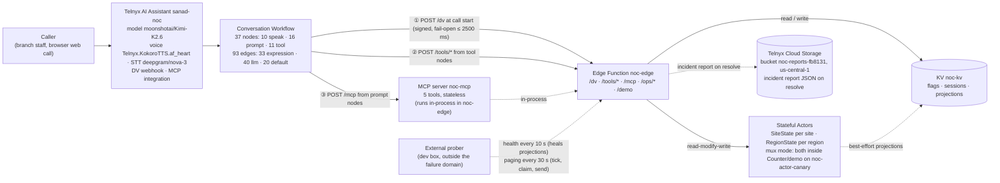

# Architecture — NOC Front Door

The literal chain: Caller → Assistant (`sanad-noc`) → Conversation Workflow → Edge Function `noc-edge` → KV / Stateful Actors → MCP server. Cloud Storage holds resolved incident reports; an external prober keeps the edge warm, heals projections and drives paging.

## The chain

- `① POST /dv` at call start returns the dynamic variables (signed, fail-open ≤ 2500 ms) and steers `route_hint`.
- `② POST /tools/*` are the tool-node webhooks (`verify-site`, `open-ticket`, `join-incident`, `callback`).
- `③ POST /mcp` is the assistant's MCP integration calling the 5 tools from prompt nodes; the server runs **in-process** in `noc-edge` (stateless, C4).

## Actors own the invariants

One ticket per site (`SiteState`) and incident declaration / P1 escalation at 3 sites (`RegionState`) are read-modify-write over shared state. Actor turns are single-threaded and commit atomically (C6), so 10 concurrent opens for one site produce **exactly 1 ticket** — [`docs/evidence/race-test.txt`](evidence/race-test.txt): actor mode created 1 (`NJD-9902`), KV mode created 10 duplicates (an earlier inconclusive run under the old 1500 ms race deadline is in DEBUGLOG #6). Actor methods do no network I/O — results are passed in as arguments — and are idempotent (C6). There is no local actor runtime, so actors are unit-tested against an in-memory storage fake (C11).

## KV is only a projection / cache / flags

KV is last-write-wins with no compare-and-swap (C5), so no invariant ever lives there: the incident projection is re-synced from actor truth (best-effort), sessions are TTL'd blind puts, and flags are just slow config. One writer per KV key (spec §6.3). The key charset is `^[-/_=.a-zA-Z0-9]+$` — no `+` or `:`. The incident projection carries a 2 h TTL and is healed by the prober's 10 s deep-health sync (DEBUGLOG #11).

## Per-entity topology

`edge/noc-actors` declares the actor classes with no bindings (the owner); `noc-edge` binds them by reference and holds every secret — least privilege (probe P0-2e).

## Mux-mode contingency (DEBUGLOG #4)

New actor instances cannot activate on this Trial account, so the KV flag `flag/actor_mode=mux` runs the **same** `SiteState`/`RegionState` classes inside the one working instance (`Counter/demo` on noc-actor-canary, shipped as `edge/noc-actor-host`), switched through one `ActorPort` interface with zero business-logic change. `GET /ops/actor-ping?site=TST-001` shows the active mode (warm mux round-trip ≈ 220 ms).

## Alarms fire — and are fanned out (DEBUGLOG #12)

Actor alarms **do work** on this account although new instances cannot be created: the host's own (pre-existing) alarm fires and is fanned out to entities (`alarm`/`tick` → `fanOut`, delete-first), then re-armed (`reconcileAlarm`); `/ops/tick` is only the fallback. Proven live: INC-1004 escalated to L1 at 21:51:4xZ and page `INC-1004:p1` was claimed and "sent" by the prober at 21:51:53Z while every `/ops/tick` in that window reported `fired:0` — the **platform alarm** fired ([`docs/evidence/alarms-live.md`](evidence/alarms-live.md), all times UTC).

## Fail-open by design + signed identity

`/dv` answers within a hard budget (2500 ms platform timeout); if KV or actors are slow it falls back to safe defaults (`route_hint=unverified` → PIN verification) — the call still works (proven live in DEBUGLOG #8). The webhook that blocks the greeting must never be the reason a call fails (C3). Caller identity comes from the **signed body** (`call_control_id` / `call_key`), never from a header alone and never from LLM-supplied arguments (C13). Signed routes (`/dv`, `/tools/*`) fail closed: unsigned or stale → HTTP 403.

The public board is a **projection view**: the `/demo` NOC wall's board (region cards, incidents, tickets, the escalation column with SLA level + due time / ACKED, KPI tiles, client-side event feed) refreshes every 5 s from the cached public `/ops/board` — single-flight with ~8 s reuse, so viewers cannot load the single mux actor. `/ops/status` is the raw, masked status page. The operator drawer runs demo controls from the browser; its ops token stays in that tab's `sessionStorage` and is sent only to this site's `/ops` routes.

## One trace_id per call

`trace_id = "t-" + k` travels with the call — returned by `/dv`, carried in signed bodies, echoed by actors, recovered by MCP from `conv/<id>` — so `scripts/trace.sh t-<id>` shows the whole hop chain (`dv → tool → mcp …`) with `total_ms` per hop (runbook §3). Every log line is one JSON object: `{ts, lvl, svc, hop, evt, trace_id, …, total_ms, outcome}` (spec §11.1); PINs, tokens and keys are never logged, and phone numbers are masked as `+1312****309`.

## Appendix — requirements map (full detail)

| Brief requirement | Where it lives | Live evidence |
|---|---|---|
| Conversation Workflow: prompt / speak / tool nodes, `llm` / `expression` / `default` edges | `assistant/assistant.json` (37 nodes, 93 edges: 33 expression, 40 LLM, 20 default — the English core + the 13-node Arabic sub-flow) + `scripts/apply.mjs`, `scripts/lib/flow-validate.mjs` | Applied live 2026-09-27, read-back zero DRIFT (DEBUGLOG #7); Arabic mode applied live 2026-09-28 00:18 UTC+3 (per-node voice/STT overrides accepted); voice calls #2/#3 in [`docs/evidence/voice-calls.md`](evidence/voice-calls.md) |
| Callable — web call + `/demo` | `edge/noc-edge/src/demo/page.ts` (@telnyx/ai-agent-widget 0.36.0) | https://noc-edge-41d2a334-7.telnyxcompute.com/demo (phone blocked on Trial — DEBUGLOG #1) |
| Custom MCP server, ≥3 tools | `edge/noc-edge/src/mcp/` — 5 tools, two bearer scopes, stateless (C4) | Live initialize + tools/list = 5 tools; chat smoke finding (DEBUGLOG #9) |
| Dynamic-variables webhook from an Edge Function, influencing routing | `edge/noc-edge/src/dv/` — `route_hint` drives `s_open`'s expression edges | Webhook live and signed; on anonymous web calls it answers safe defaults within budget (KV latency, DEBUGLOG #6; platform delivery measured 3/5 web calls — P0-3a). Identified routing proven in unit tests and via `flag/demo_caller` (see the demo-call toggles in the [runbook](runbook.md)) |
| Edge Functions | `edge/noc-edge/telnyx.toml` + `src/router.ts`; actors in `edge/noc-actors/`, `edge/noc-actor-host/` | Live 2026-09-27: `/ops/status` 200, unsigned `/dv` 403, `/mcp` 401 + GET 405 (DEBUGLOG #4, update 2026-09-27) |
| KV | `edge/noc-edge/src/services/{kvPort,flags,directory}.ts`; keys in `edge/shared/src/kvkeys.ts` | Flags live (`deflection_enabled`, `require_pin`, `actor_mode`, `flag/fault/*`); latency finding (DEBUGLOG #6) |
| Stateful Actors with read-modify-write | `edge/noc-actors/src/{SiteState,RegionState}.ts`; mux host `edge/noc-actor-host/src/MuxHost.ts`; unit-tested on fakes (C11) | `/ops/actor-ping` → mux, pong 220 ms; [`docs/evidence/race-test.txt`](evidence/race-test.txt) (run in mux mode): 10 concurrent opens → actor 1 ticket vs KV 10 |
| Structured logs (one JSON line: `{ts, lvl, svc, hop, evt, trace_id, …, total_ms, outcome}`) | `edge/shared/src/log.ts`, `edge/noc-edge/src/log.ts` | `scripts/trace.sh` over live logs; runbook §2–3 |
| A signal beyond logs | `scripts/prober.mjs`, `GET /ops/status`, `GET /ops/health/deep` | Prober alerting + degraded≠down semantics (runbook §1) |
| "Know within a minute" answer | `scripts/prober.mjs` — 10 s interval, 2 consecutive failures ≈ ≤30 s worst case (edge-function outages: KV, actors, MCP server, config; assistant-level failures surface in the Portal + `trace.sh`) | [runbook](runbook.md) |
| A real debugging story | `DEBUGLOG.md` #5–#14 | KV latency found by our own logs within a minute (#5); the voice-call failure chain (#8); review catches #13–#14 |
| OpenCode + Telnyx Inference as the coding model | `opencode.jsonc`, `AGENTS.md` | [`DOGFOODING.md`](../DOGFOODING.md): 57 OpenCode-authored commits (`git log --grep 'Assisted-by: OpenCode'`), ≈$0.25–0.30 per run |
| Public deployment | https://noc-edge-41d2a334-7.telnyxcompute.com (`/demo`, `/ops/status`) | Live since 2026-09-27 |
| Docs | `README.md`, `docs/runbook.md`, `DEBUGLOG.md`, `DOGFOODING.md`, `docs/evidence/` | This repo |

### Stretch goals (full detail)

| Status | Goal | Evidence |
|---|---|---|
| Built & live | Variable-comparison edges — 19 expression edges in the English core (33 across the full flow), incl. `telnyx_conversation_duration_secs` escalation (DUR) and `telnyx_last_tool_status_code` routing | `assistant/assistant.json`; P1 upgrade at 3 sites live (voice call #3) |
| Built & live | Custom DV webhook — live, signed; `route_hint` drives the opening for identified callers | `edge/noc-edge/src/dv/`; on anonymous web calls it answers safe defaults within budget (KV latency, DEBUGLOG #6; DEBUGLOG #8 fallback); identified routing proven in unit tests + `flag/demo_caller` ([runbook](runbook.md)) |
| Built & live | KV feature flags — `deflection_enabled`, `require_pin`, `demo_caller`, fault injection `flag/fault/*`, `actor_mode` | `edge/noc-edge/src/services/flags.ts`; fault-injection drills (runbook) |
| Built & live | Shared actors — one working actor instance used by two functions | `edge/noc-actors` owner + reference binders (`noc-edge`, `noc-actor-host`); `/ops/actor-ping` |
| Built & live | Distributed tracing — one `trace_id` from `/dv` through tools, MCP and actors | `scripts/trace.sh`; runbook §3 |
| Built & live | Actor alarms — SLA escalation ladder in `RegionState`; the mux host fans the single real alarm out to entities (`/ops/tick` is only the fallback) | LIVE: INC-1004 escalated to L1 at 21:51:4xZ and page `INC-1004:p1` was claimed and "sent" by the prober at 21:51:53Z — every `/ops/tick` in that window reported `fired:0`, so the **platform alarm** fired ([`docs/evidence/alarms-live.md`](evidence/alarms-live.md), all times UTC) |
| Built, deploy pending | Object-storage incident reports — report JSON written to Telnyx Cloud Storage bucket `noc-reports-fb8131` on resolve; ops-token routes `/ops/reports` and `/ops/reports/<key>`; the board carries `last_report` | No live report write recorded yet (fix round after the review, see DEBUGLOG #13) |
| Built, config live (no Arabic call recorded yet) | Arabic mode — a Saudi-Arabic sub-flow (13 nodes) inside the single Trial assistant: per-node voice `Telnyx.Bayan.Reem` + STT `soniox/stt-rt-v5`, deterministic tool-node exits | Assistant applied live 2026-09-28 00:18 UTC+3 (37 nodes / 93 edges); the API accepted the per-node config — no Arabic call has been recorded yet; a true **second assistant** needs a higher assistant limit (asked Telnyx) |
| Built & live | Live NOC console — the `/demo` NOC wall (dark, Langfuse-style; live board, operator drawer) | LIVE 2026-09-27 23:28 UTC+3, verified in headless Chromium; [`edge/noc-edge/src/demo/page.ts`](../edge/noc-edge/src/demo/page.ts) |
| Evaluation pending (A/B by live calls) | Voice-model upgrade — TTS "Ultra" voices shortlisted, STT candidate `deepgram/flux` vs current nova-3 | P2-6 prep: A/B needs Fahad's voice calls (no credit spent) |
