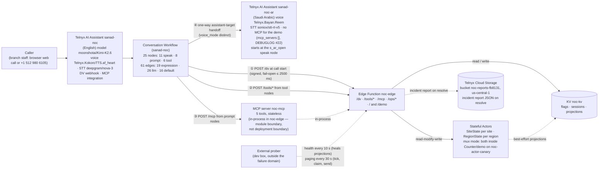

# Architecture — NOC Front Door

The literal chain: Caller → Assistant `sanad-noc` (English) → Conversation Workflow → Edge Function `noc-edge` → KV / Stateful Actors → MCP server (`noc-mcp`; the Arabic registration `noc-mcp-ar` → `/mcp?lang=ar` is built and tested but detached for the demo — DEBUGLOG #22), with a **one-way handoff** to the second assistant `sanad-noc-ar` (Saudi Arabic) — which the front page also reaches directly via the «اتصل بالعربي» button. Cloud Storage holds resolved incident reports; an external prober keeps the edge warm, heals projections and drives paging.

## The chain

- `① POST /dv` at call start returns the dynamic variables (signed, fail-open ≤ 2500 ms) and steers `route_hint`.
- `② POST /tools/*` are the tool-node webhooks (`verify-site`, `open-ticket`, `join-incident`, `callback`).
- `③ POST /mcp` is the assistant's MCP integration calling the 5 tools from prompt nodes; the server runs **in-process** in `noc-edge` (stateless, C4).
- `④` the English workflow hands off to `sanad-noc-ar` — see "Two assistants" below (facts learned live: DEBUGLOG #18).

## Two assistants, one-way handoff

`sanad-noc` (English) hands the call **one-way** to `sanad-noc-ar` — voice `Telnyx.Bayan.Reem`, STT `soniox/stt-rt-v5`, its own workflow (16 nodes: 4 speak · 6 prompt · 6 tool; 37 edges), **no MCP for the demo** (`mcp_servers []`; the `noc-mcp-ar` → `/mcp?lang=ar` registration is built and tested — one config line to re-attach, DEBUGLOG #22) — through workflow `assistant-target` edges (`voice_mode: distinct`): the 8 llm "Arabic" edges route through the speak node `s_to_ar` ("Sure, switching you to Arabic now. One moment, please."), whose one default edge targets the Arabic assistant, while `e_sopen_ar` (`route_hint=="arabic"`) targets the assistant directly; the `requireArabicExits` rule in `scripts/lib/flow-validate.mjs` fails the apply if a conversational node lacks an Arabic exit (DEBUGLOG #16). The handoff fires only on an **explicit Arabic request** (P3-R10, DEBUGLOG #20). The handoff keeps the conversation, history and variables; carried values win over the target's dynamic-variables webhook, and the webhook re-fires with the same `call_control_id` (same session key), so server-side identity survives (DEBUGLOG #18). The Arabic workflow starts at a speak node (`s_ar_open`) and routes by carried state — **verified → triage, known incident → advisory, ticket open → confirm, otherwise intake** — so a caller verified in English is never asked for the PIN again (proven live on call #9, which routed to `n_ar_confirm` with no PIN re-ask — DEBUGLOG #22). The platform intermittently loses the Arabic assistant's first turn after the handoff (calls #12/#13 silent >20–30 s under identical config — DEBUGLOG #22), so the front page's «اتصل بالعربي» button also calls `sanad-noc-ar` directly (entry-neutral Arabic opening line). There are no Arabic → English edges: a caller who switches to Arabic stays in Arabic for the rest of the call (an assistant-target back would restart the English flow at `s_open`, whose `route_hint=="arabic"` edge would loop).

## Health, board, flags and page load

Semantics as of 2026-09-28 — the platform incident (DEBUGLOG #15) reshaped all four:

- **Health:** an actor **hang** that outlives two consecutive probes is **down** (`actor_hung`), not "ok-slow" — a 30 s hang was the incident's dominant failure mode and was invisible for hours. The deep-health sync check runs at most every 30 s; `degraded` with `slow:["kv"]` is still not an outage.
- **Board:** single-flight — callers join an in-flight build; the reuse window is **30 s from settle** (10 s when the build was degraded), measured from build completion, not request start, so a slow build is not thrown away the moment it lands; a rejected build is dropped so the next request rebuilds.
- **Flags:** a failed flag read enters a **30 s cooldown** that rejects fast (`flags_cooldown`) — no KV re-read, and never synthetic flags; callers run their existing safe fallbacks unchanged. The 60 s success memo is unchanged.
- **Page load:** the public page polls `/ops/board` every **15 s only while the tab is visible** (the operator console: 10 s), failures back off to 60 s, and polling pauses entirely after **10 min idle** — a forgotten tab was 60% of KV traffic during the incident.

## Actors own the invariants

One ticket per site (`SiteState`) and incident declaration / P1 escalation at 3 sites (`RegionState`) are read-modify-write over shared state. Actor turns are single-threaded and commit atomically (C6), so 10 concurrent opens for one site produce **exactly 1 ticket** — [`docs/evidence/race-test.txt`](evidence/race-test.txt): actor mode created 1 (`NJD-9902`), KV mode created 10 duplicates (an earlier inconclusive run under the old 1500 ms race deadline is in DEBUGLOG #6). Actor methods do no network I/O — results are passed in as arguments — and are idempotent (C6). There is no local actor runtime, so actors are unit-tested against an in-memory storage fake (C11).

## KV is only a projection / cache / flags

KV is last-write-wins with no compare-and-swap (C5), so no invariant ever lives there: the incident projection is re-synced from actor truth (best-effort), sessions are TTL'd blind puts, and flags are just slow config. One writer per KV key (spec §6.3). The key charset is `^[-/_=.a-zA-Z0-9]+$` — no `+` or `:`. The incident projection carries a 2 h TTL and is healed by the prober's deep-health sync — at most every 30 s (DEBUGLOG #11; see "Health, board, flags and page load").

## Per-entity topology

`edge/noc-actors` declares the actor classes with no bindings (the owner); `noc-edge` binds them by reference and holds every secret — least privilege (probe P0-2e).

## Mux-mode contingency (DEBUGLOG #4)

While the 09-26 platform fault lasted, no new actor instance could activate on this Trial account, so the KV flag `flag/actor_mode=mux` ran the **same** `SiteState`/`RegionState` classes inside the one working instance (`Counter/demo`, owned and shipped as `edge/noc-actor-host`; `noc-edge` binds it by reference as `MUX`), switched through one `ActorPort` interface with zero business-logic change. `GET /ops/actor-ping?site=TST-001` shows the active mode (warm mux round-trip ≈ 220 ms). New instances answered again from 2026-09-30 (two fresh `Counter` instances in 1.0–1.4 s). The per-entity switch ran 2026-10-01: flipped 05:34:28Z, pongs and the race test answered per-entity (pong ~195–227 ms, 4/4; actor 1/10 vs KV 10/10), but the two live calls' `verify_site` 500'd — the per-entity stubs through `noc-edge`'s binding answered ping and not the business methods (`recordPinAttempt is not a function`; stale method list on the binding, most likely) — so it was reverted to mux at 05:54:53Z (DEBUGLOG #21). Live traffic runs mux, kept as the instant flag fallback; the next flip waits on a `noc-edge` redeploy and a pre-flip check that calls a real method on a test site.

## Alarms fire — and are fanned out (DEBUGLOG #12)

Actor alarms **do work** on this account although new instances cannot be created: the host's own (pre-existing) alarm fires and is fanned out to entities (`alarm`/`tick` → `fanOut`, delete-first), then re-armed (`reconcileAlarm`); `/ops/tick` is only the fallback. Proven live: INC-1004 escalated to L1 at 21:51:4xZ and page `INC-1004:p1` was claimed and "sent" by the prober at 21:51:53Z while every `/ops/tick` in that window reported `fired:0` — the **platform alarm** fired ([`docs/evidence/alarms-live.md`](evidence/alarms-live.md), all times UTC).

## Fail-open by design + signed identity

`/dv` answers within a hard budget (2500 ms platform timeout); if KV or actors are slow it falls back to safe defaults (`route_hint=unverified` → PIN verification) — the call still works (proven live in DEBUGLOG #8). The webhook that blocks the greeting must never be the reason a call fails (C3). Caller identity comes from the **signed body** (`call_control_id` / `call_key`), never from a header alone and never from LLM-supplied arguments (C13). Signed routes (`/dv`, `/tools/*`) fail closed: unsigned or stale → HTTP 403.

The public board is a **projection view**: the front page's board (region cards, incidents, tickets, the escalation column with SLA level + due time / ACKED, KPI tiles, client-side event feed) refreshes every 15 s (visible-only) from the cached public `/ops/board` — single-flight with the 30 s-from-settle reuse above, so viewers cannot load the single mux actor. `/ops/status` is the raw, masked status page. The hidden **operator console** (open with `#console` or the backtick key) runs demo controls from the browser; its ops token stays in that tab's `sessionStorage` and is sent only to this site's `/ops` routes.

## One trace_id per call

`trace_id = "t-" + k` travels with the call — returned by `/dv`, carried in signed bodies, echoed by actors, recovered by MCP from `conv/<id>` — so `scripts/trace.sh t-<id>` shows the whole hop chain (`dv → tool → mcp …`) with `total_ms` per hop (runbook §3). Every log line is one JSON object: `{ts, lvl, svc, hop, evt, trace_id, …, total_ms, outcome}` (spec §11.1); PINs, tokens and keys are never logged, and phone numbers are masked as `+1312****309`.

## Appendix — requirements map (full detail)

| Brief requirement | Where it lives | Live evidence |
|---|---|---|
| Conversation Workflow: prompt / speak / tool nodes, `llm` / `expression` / `default` edges | `assistant/assistant.json` (25 nodes, 61 edges: 19 expression, 26 LLM, 16 default) + `assistant/assistant-ar.json` (16 nodes, 37 edges: 17 expression, 11 LLM, 9 default) + `scripts/apply.mjs`, `scripts/lib/flow-validate.mjs` | Applied live 2026-09-27, read-back zero DRIFT (DEBUGLOG #7); both assistants live 2026-09-28 (`s_ar_open` routing applied 23:25Z; Arabic MCP applied then detached for the demo 2026-10-01 — decisions #9, DEBUGLOG #22; `s_to_ar` bridge added 2026-10-01); voice calls #2–#6 and #9–#13 in [`docs/evidence/voice-calls.md`](evidence/voice-calls.md) |
| Callable — web call + phone line | `edge/noc-edge/src/demo/page.ts` (@telnyx/ai-agent-widget 0.36.0); the US number on `sanad-noc`'s TeXML connection | https://noc-edge-41d2a334-7.telnyxcompute.com/ (browser call) or dial `+1 512 980 6105` — PSTN call #5; the «اتصل بالعربي» hero button calls `sanad-noc-ar` directly (text-tested 2026-10-01; voice test pending); the account was verified 2026-09-28, before that no number could be ordered (DEBUGLOG #1) |
| Custom MCP server, ≥3 tools | `edge/noc-edge/src/mcp/` — 5 tools, two bearer scopes, stateless (C4) | Live initialize + tools/list = 5 tools; chat smoke finding (DEBUGLOG #9) |
| Dynamic-variables webhook from an Edge Function, influencing routing | `edge/noc-edge/src/dv/` — `route_hint` drives `s_open`'s expression edges | Webhook live and signed; on anonymous web calls it answers safe defaults within budget (KV latency, DEBUGLOG #6; fallback on call #1, DEBUGLOG #8). Identified routing (`known_incident` / `verified` / `arabic`) is unit-tested and driven live by the `flag/demo_caller` toggles ([runbook](runbook.md) demo-call toggles); a recorded identified live call is TODO-LIVE |
| Edge Functions | `edge/noc-edge/telnyx.toml` + `src/router.ts`; actors in `edge/noc-actors/`, `edge/noc-actor-host/` | Live 2026-09-27: `/ops/status` 200, unsigned `/dv` 403, `/mcp` 401 + GET 405 (DEBUGLOG #4, update 2026-09-27) |
| KV | `edge/noc-edge/src/services/{kvPort,flags,directory}.ts`; keys in `edge/shared/src/kvkeys.ts` | Flags live (`deflection_enabled`, `require_pin`, `actor_mode`, `flag/fault/*`); latency finding (DEBUGLOG #6) |
| Stateful Actors with read-modify-write | `edge/noc-actors/src/{SiteState,RegionState}.ts`; mux host `edge/noc-actor-host/src/MuxHost.ts`; unit-tested on fakes (C11) | `/ops/actor-ping` → mux, pong 220 ms; [`docs/evidence/race-test.txt`](evidence/race-test.txt): 10 concurrent opens → actor 1 ticket vs KV 10 (run in mux mode; re-run in per-entity mode 2026-10-01 with the same 1 vs 10 — DEBUGLOG #21) |
| Structured logs (one JSON line: `{ts, lvl, svc, hop, evt, trace_id, …, total_ms, outcome}`) | `edge/shared/src/log.ts`, `edge/noc-edge/src/log.ts` | `scripts/trace.sh` over live logs; runbook §2–3 |
| A signal beyond logs | `scripts/prober.mjs`, `GET /ops/status`, `GET /ops/health/deep` | Prober alerting + degraded≠down semantics (runbook §1) |
| "Know within a minute" answer | `scripts/prober.mjs` — 10 s interval, 2 consecutive failures ≈ ≤30 s worst case (edge-function outages: KV, actors, MCP server, config; assistant-level failures surface in the Portal + `trace.sh`) | [runbook](runbook.md) |
| A real debugging story | `DEBUGLOG.md` #5–#18 | KV latency found by our own logs within a minute (#5); the voice-call failure chain (#8); review catches #13–#14; the platform incident RCA (#15) and the live-call findings #16–#18 |
| OpenCode + Telnyx Inference as the coding model | `opencode.jsonc`, `AGENTS.md` | [`DOGFOODING.md`](../DOGFOODING.md): 89 of 112 commits as of `e6c9772` carry `Assisted-by: OpenCode` (`git log --grep 'Assisted-by: OpenCode'`), ≈$0.25–0.30 per Flash run; the cost table and the Kimi-K3 credit-floor lesson |
| Public deployment | https://noc-edge-41d2a334-7.telnyxcompute.com (`/`, `/demo`, `/ops/status`) | Live since 2026-09-27 |
| Docs | `README.md`, `docs/runbook.md`, `DEBUGLOG.md`, `DOGFOODING.md`, `docs/evidence/` | This repo |

### Stretch goals (full detail)

| Status | Goal | Evidence |
|---|---|---|
| Built & live | Variable-comparison edges — 19 expression edges in the English core (33 across the full flow), incl. `telnyx_conversation_duration_secs` escalation (DUR) and `telnyx_last_tool_status_code` routing | `assistant/assistant.json`; P1 upgrade at 3 sites live (voice call #3) |
| Built & live | Custom DV webhook — live, signed; `route_hint` drives the opening for identified callers | `edge/noc-edge/src/dv/`; on anonymous web calls it answers safe defaults within budget (KV latency, DEBUGLOG #6; DEBUGLOG #8 fallback); identified routing unit-tested + `flag/demo_caller` toggles ([runbook](runbook.md)); recorded identified live call TODO-LIVE |
| Built & live | KV feature flags — `deflection_enabled`, `require_pin`, `demo_caller`, fault injection `flag/fault/*`, `actor_mode` | `edge/noc-edge/src/services/flags.ts`; `flag/actor_mode=mux` flipped live with no redeploy; fault-injection drills (runbook) |
| Built & live | Shared actors — one working actor instance used by two functions | `noc-actor-host` owns and ships `Counter/demo` (the one working instance); `noc-edge` binds the same actor type by reference (binding `MUX`) and calls it through the `ActorPort` seam; `/ops/actor-ping` |
| Built & live | Distributed tracing — one `trace_id` from `/dv` through tools, MCP and actors | `scripts/trace.sh`; runbook §3 |
| Built & live | Actor alarms — SLA escalation ladder in `RegionState`; the mux host fans the single real alarm out to entities (`/ops/tick` is only the fallback) | LIVE: INC-1004 escalated to L1 at 21:51:4xZ and page `INC-1004:p1` was claimed and "sent" by the prober at 21:51:53Z — every `/ops/tick` in that window reported `fired:0`, so the **platform alarm** fired ([`docs/evidence/alarms-live.md`](evidence/alarms-live.md), all times UTC) |
| Built & live | Object-storage incident reports — report JSON written to Telnyx Cloud Storage bucket `noc-reports-fb8131` on resolve; ops-token routes `/ops/reports` and `/ops/reports/<key>`; the board carries `last_report` | LIVE 2026-09-28: resolving INC-1004 wrote `incidents/INC-1004-2026-09-27T21-46-42Z.json` (926 B) — listed and fetched back, `last_report` pointer on the board (DEBUGLOG #13). Cloud Storage was suspended 2026-09-30 while the balance was negative; restored 2026-10-01 04:51Z |
| Built & live | Multi-assistant — a second assistant `sanad-noc-ar` (Saudi Arabic: voice `Telnyx.Bayan.Reem`, STT `soniox/stt-rt-v5`; no MCP for the demo — `mcp_servers []`, built and tested, DEBUGLOG #22) reached by a one-way workflow assistant-target handoff (through the `s_to_ar` bridge speak node) **or directly** — the front page's third hero button «اتصل بالعربي» starts a browser call straight to it (phone callers still reach Arabic through the handoff); the Arabic flow starts at a speak node and routes by carried state, so a verified caller skips re-verification | Second assistant live 2026-09-28; handoff proven on live call #6; **first verified EN→AR handoff call #9** (skip live, DEBUGLOG #22); the handoff is intermittently silent on the platform (#12/#13 — being reported to Telnyx, DEBUGLOG #22); explicit-only handoff condition after call #7a (DEBUGLOG #20); direct entry text-tested 2026-10-01 (voice test pending) |
| Built & live | Live NOC console — the production front page (call launcher, live network status map) plus a hidden operator console (`#console` or the backtick key: scenarios + PINs, detailed board, event feed, how-it-works, presenter controls) | LIVE 2026-09-28, verified in headless Chromium (desktop/mobile/console); [`edge/noc-edge/src/demo/page.ts`](../edge/noc-edge/src/demo/page.ts) |
| Evaluation pending (A/B by live calls) | Voice-model upgrade — TTS "Ultra" voices shortlisted, STT candidate `deepgram/flux` vs current nova-3 | P2-6 prep: A/B needs Fahad's voice calls (no credit spent) |
